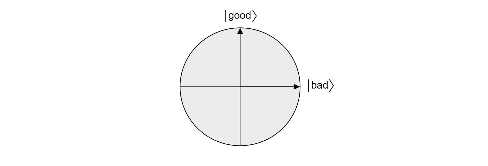
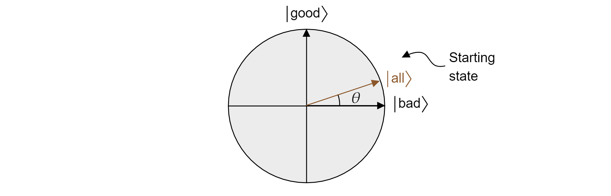

# Theory of Grover's search algorithm

In this article you'll find a detailed theoretical explanation of the mathematical principles that make Grover's algorithm work.

For a practical implementation of Grover's algorithm to solve mathematical problems you can read our [guide to implement Grover's search algorithm](xref:microsoft.quantum.tutorial-qdk.grovers).

## Statement of the problem

Any search task can be expressed with an abstract function $f(x)$ that accepts search items $x$. If the item $x$ is a solution to the search task, then $f(x)=1$. If the item $x$ isn't a solution, then $f(x)=0$. The *search problem* consists of finding any item $x_0$ such that $f(x_0)=1$.

The task that Grover's algorithm aims to solve can be expressed as follows: given a classical function $f(x):\\{0,1\\}^n \rightarrow\\{0,1\\}$, where $n$ is the bit-size of the search space, find an input $x_0$ for which $f(x_0)=1$. The complexity of the algorithm is measured by the number of uses of the function $f(x)$. Classically, in the worst-case scenario, $f(x)$ has to be evaluated a total of $N-1$ times, where $N=2^n$, trying out all the possibilities. After $N-1$ elements, it must be the last element. Grover's quantum algorithm can solve this problem much faster, providing a quadratic speed up. Quadratic here implies that only about $\sqrt{N}$ evaluations would be required, compared to $N$.

## Outline of the algorithm

Suppose there are $N=2^n$ eligible items for the search task and they are index by assigning each item an integer from $0$ to $N-1$. Further, suppose that there are $M$ different valid inputs, meaning that there are $M$ inputs for which $f(x)=1$. The steps of the algorithm are then as follows:

1. Start with a register of $n$ qubits initialized in the state $\ket{0}$.
1. Prepare the register into a uniform superposition by applying $H$ to each qubit of the register: $$|\text{register}\rangle=\frac{1}{\sqrt{N}} \sum_{x=0}^{N-1}|x\rangle$$
1. Apply the following operations to the register $N_{\text{optimal}}$ times:
   1. The phase oracle $O_f$ that applies a conditional phase shift of $-1$ for the solution items.
   1. Apply $H$ to each qubit in the register.
   1. A conditional phase shift of $-1$ to every computational basis state except $\ket{0}$. This can be represented by the unitary operation $-O_0$, as $O_0$ represents the conditional phase shift to $\ket{0}$ only.
   1. Apply $H$ to each qubit in the register.
1. Measure the register to obtain the index of a item that's a solution with very high probability.
1. Check if it's a valid solution. If not, start again.

$N_\text{optimal} = \left\lfloor \frac{\pi}{4}\sqrt{\frac{N}{M}}-\frac{1}{2} \right\rfloor$ is the optimal number of iterations that maximizes the likelihood of obtaining the correct item by measuring the register.

> [!NOTE]
> The joint application of the steps 3.b, 3.c and 3.d is usually known in the literature as Grover's diffusion operator.

The overall unitary operation applied to the register is:

$$(-H^{\otimes n}O_0H^{\otimes n}O_f)^{N_{\text{optimal}}}H^{\otimes n}$$

## Following the register's state step by step

To illustrate the process, let's follow the mathematical transformations of the state of the register for a simple case in which there are only two qubits and the valid element is $\ket{01}.$

1. The register starts in the state:
   $$|\text{register}\rangle=|00\rangle$$

1. After applying $H$ to each qubit the register's state transforms to:
   $$|\text{register}\rangle = \frac{1}{\sqrt{4}} \sum_{i \in \\{0,1\\}^2}|i\rangle=\frac12(\ket{00}+\ket{01}+\ket{10}+\ket{11})$$

1. Then, the phase oracle is applied to get:
   $$|\text{register}\rangle = \frac12(\ket{00}-\ket{01}+\ket{10}+\ket{11})$$

1. Then $H$ acts on each qubit again to give:
   $$|\text{register}\rangle = \frac12(\ket{00}+\ket{01}-\ket{10}+\ket{11})$$

1. Now the conditional phase shift is applied on every state except $\ket{00}$:
   $$|\text{register}\rangle = \frac12(\ket{00}-\ket{01}+\ket{10}-\ket{11})$$

1. Finally, the first Grover iteration ends by applying $H$ again to get:
   $$|\text{register}\rangle = \ket{01}$$

   By following the above steps, the valid item is found in a single iteration. As it will be seen later, this is because for N=4 and a single valid item, $N_\text{optimal}=1$.

## Geometrical explanation

To see why Grover's algorithm works, let's study the algorithm from a geometrical perspective. Let $\ket{\text{bad}}$ be the superposition of all states that aren't a solution to the search problem. Supposing there are $M$ valid solutions:

$$\ket{\text{bad}}=\frac{1}{\sqrt{N-M}}\sum_{x:f(x)=0}\ket{x}$$

The state $\ket{\text{good}}$ is defined as the superposition of all states that *are* a solution to the search problem:

$$\ket{\text{good}}=\frac{1}{\sqrt{M}}\sum_{x:f(x)=1}\ket{x}$$

Since *good* and *bad* are mutually exclusive sets because an item cannot be valid and not valid, the states $\ket{\text{good}}$ and $\ket{\text{bad}}$ are orthogonal. Both states form the orthogonal basis of a plane in the vector space. One can use this plane to visualize the algorithm.

Now, suppose $\ket{\psi}$ is an arbitrary state that lives in the plane spanned by $\ket{\text{good}}$ and $\ket{\text{bad}}$. Any state living in that plane can be expressed as:

$$\ket{\psi} = \alpha \ket{\text{good}} + \beta \ket{\text{bad}}$$

where $\alpha$ and $\beta$ are real numbers. Now, let's introduce the reflection operator $R_{\ket{\psi}}$, where $\ket{\psi}$ is any qubit state living in the plane. The operator is defined as:

$$R_{\ket{\psi}}=2\ket{\psi}\bra{\psi}-\mathcal{I}$$

It is called the reflection operator about $\ket{\psi}$ because it can be geometrically interpreted as reflection about the direction of $\ket{\psi}$. To see it, take the orthogonal basis of the plane formed by $\ket{\psi}$ and its orthogonal complement $\ket{\psi^{\perp}}$. Any state $\ket{\xi}$ of the plane can be decomposed in such basis:

$$\ket{\xi}=\mu \ket{\psi} + \nu {\ket{\psi^{\perp}}}$$

If one applies the operator $R_{\ket{\psi}}$ to $\ket{\xi}$:

$$R_{\ket{\psi}}\ket{\xi}=\mu \ket{\psi} - \nu {\ket{\psi^{\perp}}}$$

The operator $R_\ket{\psi}$ inverts the component orthogonal to $\ket{\psi}$ but leaves the $\ket{\psi}$ component unchanged. Therefore, $R_\ket{\psi}$ is a reflection about $\ket{\psi}$.

Grover's algorithm, after the first application of $H$ to every qubit, starts with an uniform superposition of all states. This can be written as:

$$\ket{\text{all}} = \sqrt{\frac{M}{N}}\ket{\text{good}} + \sqrt{\frac{N-M}{N}}\ket{\text{bad}}$$

And thus the state lives in the plane. Note that the probability of obtaining a correct result when measuring from the equal superposition is just $|\braket{\text{good}|{\text{all}}}|^2=M/N$, that is what we expect from a random guess.

The oracle $O_f$ adds a negative phase to any solution to the search problem. Therefore, it can be written as a reflection about the $\ket{\text{bad}}$ axis:

$$O_f = R_{\ket{\text{bad}}} = 2\ket{\text{bad}}\bra{\text{bad}} - \mathcal{I}$$

Analogously, the conditional phase shift $O_0$ is just an inverted reflection about the state $\ket{0}$:

$$O_0 = R_{\ket{0}}=  -2\ket{0}\bra{0} + \mathcal{I}$$

Knowing this fact, it's easy to check that the Grover diffusion operation $-H^{\otimes n} O_0 H^{\otimes n}$ is also a reflection about the state $\ket{all}$. Just do:

$$-H^{\otimes n} O_0 H^{\otimes n}=2H^{\otimes n}\ket{0}\bra{0}H^{\otimes n} -H^{\otimes n}\mathcal{I}H^{\otimes n} = 2\ket{\text{all}}\bra{\text{all}} - \mathcal{I} = R_{\ket{\text{all}}}$$

It has been demonstrated that each iteration of Grover's algorithm is a composition of two reflections $R_\ket{\text{bad}}$ and $R_\ket{\text{all}}$.

The combined effect of each Grover iteration is a counterclockwise rotation of an angle $2\theta$. Fortunately, the angle $\theta$ is easy to find. Since $\theta$ is just the angle between $\ket{\text{all}}$ and $\ket{\text{bad}}$, one can use the scalar product to find the angle. It is known that $\cos{\theta}=\braket{\text{all}|\text{bad}}$, so one needs to calculate $\braket{\text{all}|\text{bad}}$. From the decomposition of $\ket{\text{all}}$ in terms of $\ket{\text{bad}}$ and $\ket{\text{good}}$, it follows:

$$\theta = \arccos{\left(\braket{\text{all}|\text{bad}}\right)}= \arccos{\left(\sqrt{\frac{N-M}{N}}\right)} $$

The angle between the state of the register and the $\ket{\text{good}}$ state will decrease with each iteration, resulting in a higher probability of measuring a valid result. To calculate this probability one just needs to calculate $|\braket{\text{good}|\text{register}}|^2$. Denoting the angle between $\ket{\text{good}}$ and $\ket{\text{register}}$ $\gamma (k)$, where $k$ is the iteration count:

$$\gamma (k) = \frac{\pi}{2}-\theta -k2\theta = \frac{\pi}{2} -(2k + 1) \theta $$

Therefore, the probability of success is:

$$P(\text{success}) = \cos^2(\gamma(k)) = \sin^2\left[(2k +1)\arccos \left( \sqrt{\frac{N-M}{N}}\right)\right]$$

## Optimal number of iterations

As the probability of success can be written as a function of the number of iterations, the optimal number of iterations $N_{\text{optimal}}$ can be found by computing the smallest positive integer that (approximately) maximizes the success probability function.

It is known that $\sin^2{x}$ reaches its first maximum for $x=\frac{\pi}{2}$, so:

$$\frac{\pi}{2}=(2k_{\text{optimal}} +1)\arccos \left( \sqrt{\frac{N-M}{N}}\right)$$

This gives:

$$k_{\text{optimal}} = \frac{\pi}{4\arccos\left(\sqrt{1-M/N}\right)}-1/2 = \frac{\pi}{4}\sqrt{\frac{N}{M}}-\frac{1}{2}-O\left(\sqrt\frac{M}{N}\right)$$

Where in the last step, $\arccos \sqrt{1-x} = \sqrt{x} + O(x^{3/2})$.

Therefore one can pick $N_\text{optimal}$ to be $N_\text{optimal} = \left\lfloor \frac{\pi}{4}\sqrt{\frac{N}{M}}-\frac{1}{2} \right\rfloor$.

## Complexity analysis

From the previous analysis, $O\left(\sqrt{\frac{N}{M}}\right)$ queries of the oracle $O_f$ are needed to find a valid item. However, can the algorithm be implemented efficiently in terms of time complexity? $O_0$ is based on computing Boolean operations on $n$ bits and is known to be implementable using $O(n)$ gates. There are also two layers of $n$ Hadamard gates. Both of these components thus require only $O(n)$ gates per iteration. Because $N=2^n$, it follows that $O(n)=O(log(N))$. Therefore, if $O\left(\sqrt{\frac{N}{M}}\right)$ iterations and $O(log(N))$ gates per iteration are needed, the total time complexity (without taking into account the oracle implementation) is $O\left(\sqrt{\frac{N}{M}}log(N)\right)$.

The overall complexity of the algorithm will ultimately depend on the complexity of the implementation of the oracle $O_f$. If a function evaluation is much more complicated on a quantum computer than on a classical one, the overall algorithm runtime will be longer in the quantum case, even though technically, it will use fewer queries.

## References

If you want to continue learning about Grover's algorithm, you can check any of the following sources:

- [Original paper by Lov K. Grover](https://arxiv.org/abs/quant-ph/9605043)
- Quantum search algorithms section of Nielsen, M. A. & Chuang, I. L. (2010). Quantum Computation and Quantum Information.
- [Grover's algorithm on Arxiv.org](https://arxiv.org/search/?searchtype=all&query=Grover%27s+algorithm&abstracts=show&size=50&order=announced_date_first)
