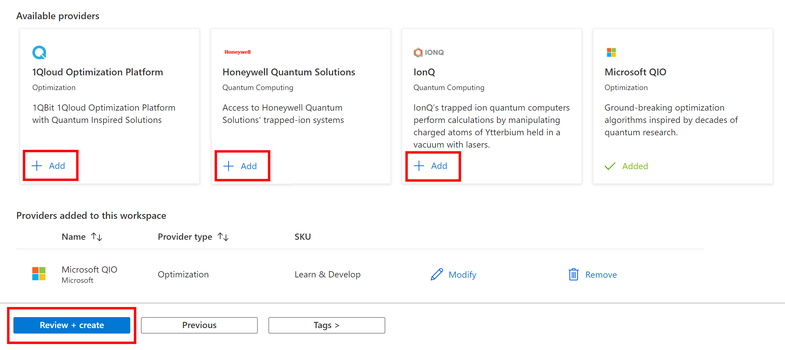

# Create Azure Quantum workspaces with the Azure portal

In this guide, learn to create Azure Quantum workspaces and the required Resource Groups and Storage Accounts using
the Azure portal, and start running your quantum applications in Azure Quantum.

## Prerequisites

In order to use the Azure Quantum service, you will need an active Azure subscription.

> [!NOTE]
> For more information about creating an Azure account and subscription, see the Microsoft Learn module [Create an Azure account](https://docs.microsoft.com/learn/modules/create-an-azure-account/).

## Create an Azure Quantum workspace

You use the Azure Quantum service by adding an Azure Quantum workspace resource to your Azure subscription in the Azure portal. An Azure Quantum workspace resource, or workspace for short, is a collection of assets associated with running quantum or optimization applications.

To open the Azure Portal, go to https://portal.azure.com and then follow these steps:

1. Click **Create a resource** and then search for **Azure Quantum**. On the results page, you should see a tile for the **Azure Quantum (preview)** service.

   

1. Click **Azure Quantum (preview)** and then click  **Create**. This opens a form to create a workspace.

   

1. Fill out the details of your workspace:
   - **Subscription:** The subscription that you want to associate with this
     workspace. 
   - **Resource group:** The resource group that you want to assign this workspace to.
   - **Name:** The name of your workspace.
   - **Region:** The region for the workspace.
   - **Storage Account**: The Azure storage account to store your jobs and results. If you don't have an existing storage account, click **Create a new storage account** and complete the necessary fields. For this preview, we recommend using the default values.

   

   > [!NOTE]
   > You must be an Owner of the selected resource group to create a new storage account. For more information about how resource groups work in Azure, see [Control and organize Azure resources with Azure Resource Manager](https://docs.microsoft.com/learn/modules/control-and-organize-with-azure-resource-manager/).

1. After completing the information, click the **Providers** tab to add providers to your workspace. A provider gives you access to a quantum service, which can be quantum hardware, a quantum simulator, or an optimization service.

   

   > [!NOTE]
   > By default, Azure Quantum adds the Microsoft QIO provider to every workspace.

1. After adding the providers that you want to use, click **Review + create**.

1. Review the settings and approve the *Terms and Conditions of Use* of
   the selected providers. If everything is correct, click on **Create** to create your workspace.

   

> [!NOTE] 
> While we are not charging for usage of Azure Quantum during this
> preview, your jobs will be uploaded to the Azure storage account created above and will be subject to storage charges.

## Next steps

Now that you created a workspace, learn about the different [targets to run
quantum algorithms in Azure
Quantum](xref:microsoft.quantum.concepts.targets).
