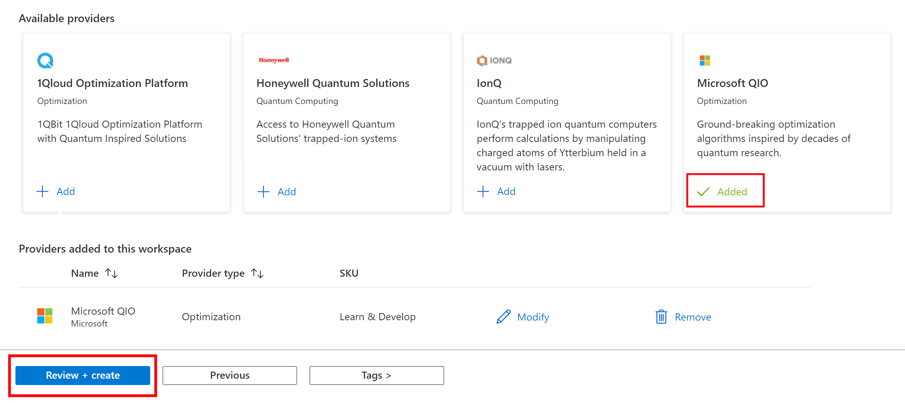

# Create an Azure Quantum workspace

Learn how to create an [Azure Quantum](xref:microsoft.quantum.azure-quantum-overview) workspace. An Azure Quantum workspace resource, or workspace for short, is a collection of assets associated with running quantum or optimization applications.

A workspace is needed to [get started with Jupyter notebooks in Azure Quantum](xref:microsoft.quantum.get-started.notebooks).

> [!TIP]
> You can also create an Azure Quantum workspace using the Azure command-line interface (CLI). For more information, see [Manage quantum workspaces with the Azure CLI](xref:microsoft.quantum.workspaces-cli).

## Free Azure Quantum credits

You can get $500 USD free credit for use on quantum hardware through Azure. The Azure Quantum Credits program provides sponsored access to quantum hardware through Azure. You will not be charged for usage created under the credits program. Your default credit grant is USD 500 equivalent, expressed in hardware credits. See the quota utilization section in the workspace, once you completed your workspace creation.

To get the free credit, select the **IonQ** provider when you create the Azure Quantum workspace.

## Prerequisites

You need the following prerequisites to create a workspace.

- An Azure account with an active subscription. [Create an account for free](https://azure.microsoft.com/free/?WT.mc_id=A261C142F).

- You must be an **Owner** of the resource group you use, to create a new storage account. For more information about how resource groups work in Azure, see [Manage Azure Resource Manager resource groups by using the Azure portal](/azure/azure-resource-manager/management/manage-resource-groups-portal).

## Create the workspace

> [!NOTE]
> If you have any questions regarding the workspace creation process or run into any issue at any point using Azure Quantum, bookmark [Azure Quantum office hours](https://aka.ms/AQ/OfficeHours) and join our open office hours every Thursday 8∶30 AM Pacific Standard Time zone (PST).

To create an Azure Quantum workspace, follow these steps.

1. Sign in to the [Azure portal](https://portal.azure.com) by using the credentials for your Azure subscription.

1. Select **Create a resource** and then search for **Azure Quantum**. On the results page, you should see a tile for the **Azure Quantum (preview)** service.

   

1. Select **Azure Quantum (preview)** and then select  **Create**. This opens a form to create a workspace.

   

1. Fill out the details of your workspace:
   - **Subscription:** The subscription that you want to associate with this
     workspace.
   - **Resource group:** The resource group that you want to assign this workspace to.
   - **Name:** The name of your workspace.
   - **Region:** The region for the workspace.
   - **Storage Account**: The Azure storage account to store your jobs and results. If you don't have an existing storage account, select **Create a new storage account** and complete the necessary fields. For this preview, we recommend using the default values.

   > [!IMPORTANT]
   > You must be an **Owner** of the resource group you use, to create a new storage account. For more information about how resource groups work in Azure, see [Manage Azure Resource Manager resource groups by using the Azure portal](/azure/azure-resource-manager/management/manage-resource-groups-portal).

   

1. After completing the information, select the **Providers** tab to add providers to your workspace. A provider gives you access to a quantum service, which can be quantum hardware, a quantum simulator, or an optimization service.

   

   > [!NOTE]
   > By default, the Azure Quantum service adds the Microsoft QIO provider to every workspace.

1. Select **Review + create**.

1. Review the setting you've selected and if everything is correct, select **Create** to create your workspace.

    > [!NOTE]
    > Pricing for Azure Quantum varies by provider. Please consult the information in the Providers tab of your Azure Quantum workspace in the Azure portal for the most up-to-date pricing information, or visit the [Azure Quantum pricing page](https://azure.microsoft.com/pricing/details/azure-quantum/).

## Next steps

- [Get started with Jupyter notebooks in Azure Quantum](xref:microsoft.quantum.get-started.notebooks)
- [Quickstart: Create a quantum-based random number generator in Azure Quantum](xref:microsoft.quantum.quickstarts.computing)
- [Quickstart: Solve an optimization problem in Azure Quantum](xref:microsoft.quantum.quickstarts.optimization.qio)
- [Quickstart: Submit a circuit with Qiskit to Azure Quantum](xref:microsoft.quantum.quickstarts.computing.qiskit)
