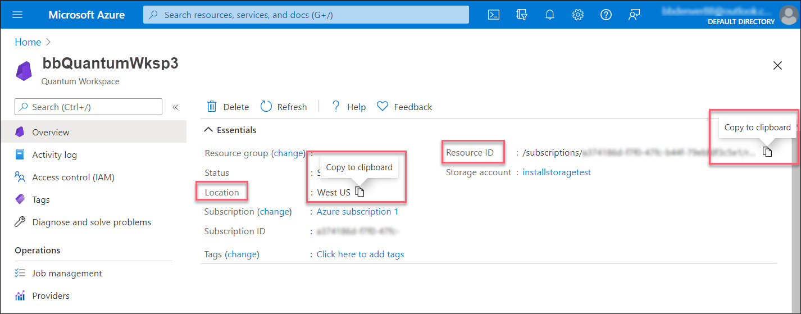

## Load the required imports

First, run the following cell to load the required imports:

```python
from azure.quantum.cirq import AzureQuantumService
```

## Connect to the Azure Quantum service

To connect to the Azure Quantum service, your program will need the resource ID and the
location of your Azure Quantum workspace. Log in to your Azure account,
<https://portal.azure.com>, navigate to your Azure Quantum workspace, and
copy the values from the header.



Paste the values into the following `AzureQuantumService` constructor to
create a `service` object that connects to your Azure Quantum workspace.
Optionally, specify a default target:

```python
service = AzureQuantumService(
    resource_id="",
    location="",
    default_target="ionq.simulator"
)
```

### List all targets

You can now list all the targets that you have access to, including the
current queue time and availability.

```python
service.targets()
```

```output
[<Target name="ionq.qpu", avg. queue time=345 s, Available>,
<Target name="ionq.simulator", avg. queue time=4 s, Available>,
<Target name="honeywell.hqs-lt-s1", avg. queue time=0 s, Available>,
<Target name="honeywell.hqs-lt-s1-apival", avg. queue time=0 s, Available>,
<Target name="honeywell.hqs-lt-s2", avg. queue time=313169 s, Available>,
<Target name="honeywell.hqs-lt-s2-apival", avg. queue time=0 s, Available>,
<Target name="honeywell.hqs-lt-s1-sim", avg. queue time=1062 s, Available>]
```

## Run a simple circuit on the API validator

> [!NOTE]
> The Honeywell API validator backend will always return 0 on measurement.

Next, create a simple Cirq circuit to run.

```python
import cirq

q0, q1 = cirq.LineQubit.range(2)
circuit = cirq.Circuit(
    cirq.H(q0), # Hadamard
    cirq.CNOT(q0, q1), # CNOT
    cirq.measure(q0, q1, key='b') # Measure both qubits
)
circuit
```

```output
0: ───H───@───M────────
          │   │
1: ───────X───M────────
```

You can now run the program via the Azure Quantum service and get the
result. The following cell submits a job that runs the circuit with
100 shots, waits until the job is complete, and returns the results.

```python
result = service.run(program=circuit, repetitions=100)
```

This returns a `cirq.Result` object.

```python
print(result)
```

```output
    b=0000000000000000000000000000000000000000000000000000000000000000000000000000000000000000000000000000
```

You can plot the results in a histogram:

```python
pl.hist(result.data)
pl.ylabel("Counts")
pl.xlabel("Result")
```

## Asynchronous workflow using Jobs

For long-running circuits, it can be useful to run them asynchronously.
The `service.create_job` method returns a `Job` object, which you can use to
get the results after the job has run successfully.

```python
job = service.create_job(
    program=circuit,
    repetitions=100
)
```

To check on the job status, use `job.status()`:

```python
job.status()
```

```output
'Waiting'
```

To wait for the job to complete and then get the results, use the blocking
call `job.results()`:

```python
result = job.results()
print(result)
```

```output
    {'m_b': ['00', '00', '00', '00', '00', '00', '00', '00', '00', '00', '00', '00', '00', '00', '00', '00', '00', '00', '00', '00', '00', '00', '00', '00', '00', '00', '00', '00', '00', '00', '00', '00', '00', '00', '00', '00', '00', '00', '00', '00', '00', '00', '00', '00', '00', '00', '00', '00', '00', '00', '00', '00', '00', '00', '00', '00', '00', '00', '00', '00', '00', '00', '00', '00', '00', '00', '00', '00', '00', '00', '00', '00', '00', '00', '00', '00', '00', '00', '00', '00', '00', '00', '00', '00', '00', '00', '00', '00', '00', '00', '00', '00', '00', '00', '00', '00', '00', '00', '00', '00']}
```

Note that this does not return a `cirq.Result` object. Instead, it
returns a dictionary of bitstring measurement results indexed by measurement key.
