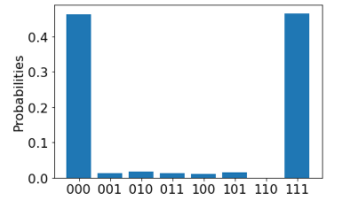

## Define a quantum circuit

Open a new cell and create a quantum circuit using the the language-agnostic JSON format supported by the [IonQ targets](xref:microsoft.quantum.providers.ionq), as described in the [IonQ API documentation](https://docs.ionq.com/#tag/quantum_programs). For example, the following sample creates a superposition between three qubits:

```python
circuit = {
    "qubits": 3,
    "circuit": [
        {
        "gate": "h",
        "target": 0
        },
        {
        "gate": "cnot",
        "control": 0,
        "target": 1
        },
        {
        "gate": "cnot",
        "control": 0,
        "target": 2
        },
    ]
}
```

## List all targets

List all the targets that you have access to, including the
current queue time and availability.

In a new cell, run:

```python
print("This workspace's targets:")
for target in service.targets():
     print(target)
```

```output
This workspace's targets:
<Target name="quantinuum.qpu.h1-1", avg. queue time=0 s, Degraded>
<Target name="quantinuum.sim.h1-1sc", avg. queue time=1 s, Available>
<Target name="quantinuum.qpu.h1-2", avg. queue time=217300 s, Unavailable>
<Target name="quantinuum.sim.h1-2sc", avg. queue time=0 s, Available>
<Target name="quantinuum.sim.h1-1e", avg. queue time=40 s, Available>
<Target name="quantinuum.sim.h1-2e", avg. queue time=64 s, Available>
<Target name="quantinuum.qpu.h1", avg. queue time=0 s, Unavailable>
<Target name="ionq.qpu", avg. queue time=229 s, Available>
<Target name="ionq.simulator", avg. queue time=3 s, Available>
<Target name="ionq.qpu.aria-1", avg. queue time=1136774 s, Available>
```

## Select a target and run your program

To check your circuit before running it on actual quantum hardware, you can use the IonQ simulator, `ionq.simulator`, which returns a `Job` object. For more information, see [Azure Quantum Job](xref:microsoft.quantum.optimization.job-reference).

Run the following code to set the target to the IonQ simulator r and submit your circuit:

```python
target = workspace.get_targets(name="ionq.simulator")
job = target.submit(circuit, num_shots=500)
```

Wait until the job is complete and then fetch the results.

```python
results = job.get_results()
print(results)
```

```output
.....
{'histogram': {'0': 0.5, '7': 0.5}}
```

You can then visualize the results using [Matplotlib](https://matplotlib.org/stable/users/installing/index.html).

```python
import pylab as pl

pl.rcParams["font.size"] = 16
hist = {format(n, "03b"): 0 for n in range(8)}
hist.update({format(int(k), "03b"): v for k, v in results["histogram"].items()})
pl.bar(hist.keys(), hist.values())
pl.ylabel("Probabilities")
```


## Estimate job cost

Before running a job on actual quantum hardware, or a [quantum processing unit](xref:microsoft.quantum.target-profiles) (QPU), you can estimate how much it will cost to run. To estimate the cost of running a job on the QPU, you can use the `estimate_cost` method.

The following code changes the target to the IonQ QPU, `ionq.qpu`, and uses the `estimate_cost` method to estimate the cost of running the job:

```python
target = workspace.get_targets(name="ionq.qpu")
cost = target.estimate_cost(circuit, num_shots=500)

print(f"Estimated cost: {cost.estimated_total}")
```

```output
Estimated cost: 1.0
```

This prints the estimated cost in USD.

For the most current pricing details, see [IonQ Pricing](xref:microsoft.quantum.providers.ionq#pricing), or view pricing options in the **Providers** blade of your workspace. To see your current credit status and usage, select **Credits and quotas**.

## Run on IonQ hardware

After running successfully on the IonQ simulator and estimating the QPU cost, it's time to run your circuit on the hardware. 

> [!NOTE] 
> The time required to run a circuit on the QPU depends on current queue times. You can view the average queue time for a target by selecting the **Providers** blade of your workspace.

Use the same `submit` method and operations that you used previously with the IonQ simulator to submit your job and display the results:

```python
target = workspace.get_targets(name="ionq.qpu")
job = target.submit(circuit, num_shots=500)
```

```python
results = job.get_results()
print(results)

pl.rcParams["font.size"] = 16
hist = {format(n, "03b"): 0 for n in range(8)}
hist.update({format(int(k), "03b"): v for k, v in results["histogram"].items()})
pl.bar(hist.keys(), hist.values())
pl.ylabel("Probabilities")
```

```output
{'histogram': {'0': 0.464, '1': 0.014, '2': 0.018, '3': 0.012, '4': 0.01, '5': 0.016, '7': 0.466}}
```


