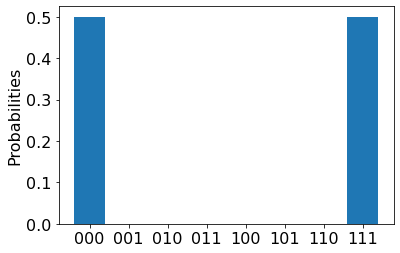

## Load the required imports

First, run the following cell to load the required imports:

```python
from azure.quantum import Workspace
```

## Connect to the Azure Quantum service

To connect to the Azure Quantum service, your program will need the resource ID and the
location of your Azure Quantum workspace. Log in to your Azure account,
<https://portal.azure.com>, navigate to your Azure Quantum workspace, and
copy the values from the header.


Paste the values into the following `Workspace` constructor to
create a `workspace` object that connects to your Azure Quantum workspace.

```python
workspace = Workspace(
    resource_id="",
    location=""
)
```

## Submit a quantum circuit to IonQ

1. Create a quantum circuit using the the language-agnostic JSON format supported by the [IonQ targets](xref:microsoft.quantum.providers.ionq), as described in the [IonQ API documentation](https://docs.ionq.com/#tag/quantum_programs). For example, the following sample creates a superposition between three qubits:

    ```python
    circuit = {
        "qubits": 3,
        "circuit": [
            {
            "gate": "h",
            "target": 0
            },
            {
            "gate": "cnot",
            "control": 0,
            "target": 1
            },
            {
            "gate": "cnot",
            "control": 0,
            "target": 2
            },
        ]
    }
    ```

1. Submit the circuit to the IonQ target. The following example uses the IonQ simulator, which returns a `Job` object. For more information, see [Azure Quantum Job](xref:microsoft.quantum.optimization.job-reference).

    ```python
    target = workspace.get_targets(name="ionq.simulator")
    job = target.submit(circuit)
    ```

1. Wait until the job is complete and then fetch the results.

    ```python
    results = job.get_results()
    print(results)
    ```

    ```output
    .....
    {'duration': 8240356, 'histogram': {'0': 0.5, '7': 0.5}}
    ```

1. You can then visualize the results using [Matplotlib](https://matplotlib.org/stable/users/installing/index.html).

    ```python
    import pylab as pl
    pl.rcParams["font.size"] = 16
    hist = {format(n, "03b"): 0 for n in range(8)}
    hist.update({format(int(k), "03b"): v for k, v in results["histogram"].items()})
    pl.bar(hist.keys(), hist.values())
    pl.ylabel("Probabilities")
    ```




## Estimate job cost

Before running a job on the QPU, you can estimate how much it will cost to run. To estimate the cost of running a job on the QPU,you can use the `estimate_cost` method:

```python
target = IonQ(workspace=workspace, name="ionq.qpu")
cost = target.estimate_cost(circuit, num_shots=500)

print(f"Estimated cost: {cost.estimated_total}")
```

This prints the estimated cost in USD.

For the most current pricing details, see [IonQ Pricing](xref:microsoft.quantum.providers.ionq#pricing), or find your workspace and view pricing options in the "Provider" tab of your workspace via: [aka.ms/aq/myworkspaces](https://aka.ms/aq/myworkspaces).
