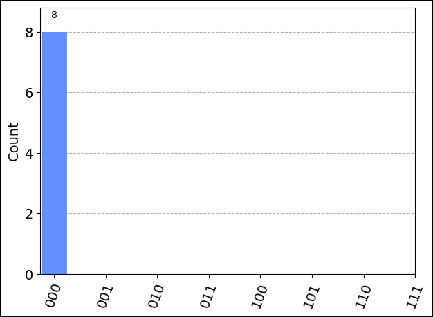
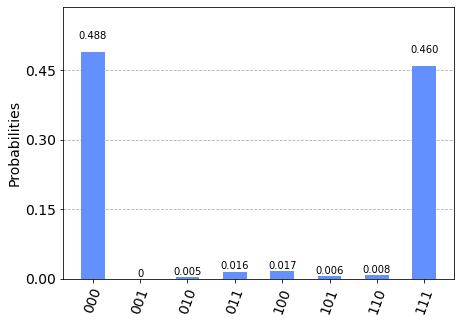

## Load the required imports

First, run the following cell to load the required imports:

```python
from qiskit import QuantumCircuit
from qiskit.visualization import plot_histogram
from qiskit.tools.monitor import job_monitor
from azure.quantum.qiskit import AzureQuantumProvider
```

## Connect to the Azure Quantum service

To connect to the Azure Quantum service, your program will need the resource ID and the
location of your Azure Quantum workspace. Log in to your Azure account,
<https://portal.azure.com>, navigate to your Azure Quantum workspace, and
copy the values from the header.


Paste the values into the following `AzureQuantumProvider` constructor to
create a `provider` object that connects to your Azure Quantum workspace.

```python
provider = AzureQuantumProvider(
  resource_id="",
  location=""
)
```

### List all backends

You can now print all of the quantum computing backends that are
available on your workspace:

```python
print([backend.name() for backend in provider.backends()])
```

```output
    ['ionq.simulator', 'ionq.qpu', 'honeywell.hqs-lt-s1', 'honeywell.hqs-lt-s1-apival', 'honeywell.hqs-lt-s1-sim']
```

## Run on the API validator 

> [!NOTE]
> The [Honeywell API validator](xref:microsoft.quantum.providers.honeywell#api-validator) backend will always return 0 on measurement.

```python
# Get Honeywell's API validator backend:
apival_backend = provider.get_backend("honeywell.hqs-lt-s1-apival")
```

```python
# Create a Quantum Circuit acting on the q register
circuit = QuantumCircuit(3, 3)
circuit.name = "Qiskit Sample - 3-qubit GHZ circuit"
circuit.h(0)
circuit.cx(0, 1)
circuit.cx(1, 2)
circuit.measure([0,1,2], [0, 1, 2])

# Print out the circuit
circuit.draw()
```

```html
     ┌───┐          ┌─┐      
q_0: ┤ H ├──■───────┤M├──────
     └───┘┌─┴─┐     └╥┘┌─┐   
q_1: ─────┤ X ├──■───╫─┤M├───
          └───┘┌─┴─┐ ║ └╥┘┌─┐
q_2: ──────────┤ X ├─╫──╫─┤M├
               └───┘ ║  ║ └╥┘
c: 3/════════════════╩══╩══╩═
                     0  1  2 
```

```python
# Submit the circuit to run on Azure Quantum
job = apival_backend.run(circuit, count=1024)
job_id = job.id()
print("Job id", job_id)

# Monitor job progress and wait until complete:
job_monitor(job)

# Get the job results (this method also waits for the Job to complete):
result = job.result()
print(result)
counts = {format(n, "03b"): 0 for n in range(8)}
counts.update(result.get_counts(circuit))
print(counts)
plot_histogram(counts)
```

```output
Job id 00000000-0000-0000-0000-000000000000
Job Status: job has successfully run
Result(backend_name='honeywell.hqs-lt-s1-apival', backend_version='1', qobj_id='Qiskit Sample - 3-qubit GHZ circuit', job_id='00000000-0000-0000-0000-000000000000', success=True, results=[ExperimentResult(shots=1024, success=True, meas_level=2, data=ExperimentResultData(counts={'000': 1024}, probabilities={'000': 1.0}), header=QobjExperimentHeader(name='Qiskit Sample - 3-qubit GHZ circuit'))])
{'000': 1024, '001': 0, '010': 0, '011': 0, '100': 0, '101': 0, '110': 0, '111': 0}
```




## Estimate job cost

Before running a job on the QPU, you may want to estimate how much it will cost to run. To estimate the cost of running a job on the QPU, you can use the following script:

```python
HQC = 5 + num_shots * (N_1q + 10 * N_2q + 5 * N_m) / 5000
```

this returns the cost in HQC, or "Honeywell Quantum Credits". Here, `N_1q` is the number of one-qubit gates, `N_2q` is the number of two-qubit gates, `N_m` is the number of measurement operators, and `num_shots` is the number of shots.

For the most current pricing details, see [Honeywell System Model H1](xref:microsoft.quantum.providers.honeywell#honeywell-system-model-h1), or find your workspace and view pricing options in the "Provider" tab of your workspace via: [aka.ms/aq/myworkspaces](http://aka.ms/aq/myworkspaces).


## Run on a Honeywell QPU 

After running successfully on the API validator, you can run your job on one of Honeywell's hardware processors (a [Quantum Processor Unit](xref:microsoft.quantum.target-profiles#quantum-processing-units-qpu-different-profiles) (QPU)).

> [!NOTE] 
> The time required to run a circuit on the QPU may vary depending on current queue times.

```python
# Get Honeywell's QPU backend:
qpu_backend = provider.get_backend("honeywell.hqs-lt-s1")
```

```python
# Submit the circuit to run on Azure Quantum
job = qpu_backend.run(circuit, count=500)
job_id = job.id()
print("Job id", job_id)

# Monitor job progress and wait until complete:
job_monitor(job)
```

```output
Job id 00000000-0000-0000-0000-000000000000
Job Status: job has successfully run
```

```python
# Get the job results (this method also waits for the Job to complete):
result = job.result()
print(result)
counts = {format(n, "03b"): 0 for n in range(8)}
counts.update(result.get_counts(circuit))
print(counts)
plot_histogram(counts)
```

```output
Result(backend_name='honeywell.hqs-lt-s1-apival', backend_version='1', qobj_id='Qiskit Sample - 3-qubit GHZ circuit', job_id='00000000-0000-0000-0000-000000000000', success=True, results=[ExperimentResult(shots=1024, success=True, meas_level=2, data=ExperimentResultData(counts={'011': 16, '010': 5, '001': 1, '000': 500, '111': 471, '101': 6, '100': 17, '110': 8}, probabilities={'011': 0.015625, '010': 0.0048828125, '001': 0.0009765625, '000': 0.48828125, '111': 0.4599609375, '101': 0.005859375, '100': 0.0166015625, '110': 0.0078125}), header=QobjExperimentHeader(name='Qiskit Sample - 3-qubit GHZ circuit'))])
{'000': 500, '001': 1, '010': 5, '011': 16, '100': 17, '101': 6, '110': 8, '111': 471}
```



