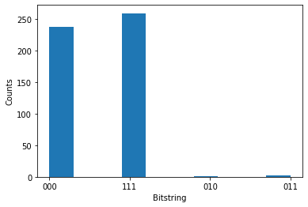

## [Native quantum](#tab/tabid-native)

## Submit a quantum circuit to Honeywell

1. Create a quantum circuit in the [OpenQASM](https://en.wikipedia.org/wiki/OpenQASM) representation. For instance, the below example creates a Teleportation circuit:

    ```py
    circuit = """OPENQASM 2.0;
    include "qelib1.inc";
    qreg q[3];
    creg c0[3];
    h q[0];
    cx q[0], q[1];
    cx q[1], q[2];
    measure q[0] -> c0[0];
    measure q[1] -> c0[1];
    measure q[2] -> c0[2];
    """
    ```

    Optionally, you can load the circuit from a file:

    ```py
    with open("my_teleport.qasm", "r") as f:
        circuit = f.read()
    ```

1. Submit the circuit to the Honeywell target. In the below example we are using the Honeywell API validator. This returns a `Job` (for more info, see [Azure Quantum Job](xref:microsoft.quantum.optimization.job-reference)).

    ```python
    target = Honeywell(workspace=workspace, target="honeywell.hqs-lt-s1-apival")
    job = target.submit(circuit, num_shots=500)
    ```

1. Wait until the job is complete and fetch the results. Note that the API validator only returns zeroes for qubit read-out results.

    ```python
    results = job.get_results()
    results
    ```

    ```output
    ........
    {'c0': ['000',
    '000',
    '000',
    '000',
    '000',
    '000',
    '000',
    ...
    ]}
    ```

1. Visualize the results

We can then visualize the results using [Matplotlib](https://matplotlib.org/stable/users/installing.html).

```python
%matplotlib inline
import pylab as pl
pl.hist(results["c0"])
pl.ylabel("Counts")
pl.xlabel("Bitstring")
```



## [Cirq](#tab/tabid-cirq)


# Getting started with Cirq and Honeywell on Azure Quantum

This notebooks shows how to send a basic quantum circuit to a Honeywell
target via Azure Quantum.

First, install `azure-quantum` with the Cirq dependencies and import the
required packages:

```python
!pip install azure-quantum[cirq]==0.18.2109.165000a1 --extra-index-url=https://pkgs.dev.azure.com/ms-quantum-public/9af4e09e-a436-4aca-9559-2094cfe8d80c/_packaging/alpha/pypi/simple/ --quiet
!pip install matplotlib --quiet

from azure.quantum.cirq import AzureQuantumService

# Plotting
import pylab as pl
%matplotlib inline
pl.rcParams["font.size"] = 16
```

## Connecting to the Azure Quantum service

To connect to the Azure Quantum service, find the resource ID and
location of your Workspace from the Azure Quantum portal here:
<https://portal.azure.com>. Navigate to your Azure Quantum workspace and
copy the values from the header.

``{=html}

```python
service = AzureQuantumService(
    resource_id="",
    location="",
    default_target="honeywell.hqs-lt-s1-apival"
)
```

### List all targets

You can now list all the targets that you have access to, including the
current queue time and availability.

```python
service.targets()
```

    [<Target name="ionq.qpu", avg. queue time=196 s, Available>,
     <Target name="ionq.simulator", avg. queue time=2 s, Available>,
     <Target name="honeywell.hqs-lt-s1", avg. queue time=0 s, Unavailable>,
     <Target name="honeywell.hqs-lt-s1-apival", avg. queue time=0 s, Available>,
     <Target name="honeywell.hqs-lt-s2", avg. queue time=0 s, Degraded>,
     <Target name="honeywell.hqs-lt-s2-apival", avg. queue time=0 s, Available>,
     <Target name="honeywell.hqs-lt-s1-sim", avg. queue time=0 s, Available>]

## Run a simple circuit

Now, let\'s create a simple Cirq circuit to run.

```python
import cirq

q0, q1 = cirq.LineQubit.range(2)
circuit = cirq.Circuit(
    cirq.H(q0),             # Hadamard
    cirq.CNOT(q0, q1),              # CNOT
    cirq.measure(q0, q1, key='b') # Measure both qubits
)
circuit
```

```{=html}
<pre style="overflow: auto; white-space: pre;">0: ───H───@───M(&#x27;b&#x27;)───
          │   │
1: ───────X───M────────</pre>
```

You can now run the program via the Azure Quantum service and get the
result. The following cell will submit a job that runs the circuit with
100 shots, wait until the job is completed and return the results.

```python
%%time
result = service.run(program=circuit, repetitions=100)
```

    ........CPU times: user 68.2 ms, sys: 4.53 ms, total: 72.7 ms
    Wall time: 10.7 s

This returns a `cirq.Result` object. Note that we used the API
validator, which only returns zeros.

```python
print(result)
```

    b=0000000000000000000000000000000000000000000000000000000000000000000000000000000000000000000000000000

Plot the results in a histogram:

```python
pl.hist(result.data)
pl.ylabel("Counts")
pl.xlabel("Result")
```

    Text(0.5, 0, 'Result')


## Asynchronous workflow using Jobs

For long-running circuits, it can be useful to run them asynchronously.
The `service.create_job` method returns a `Job`, which you can use to
get the results after the job has run successfully.

```python
%%time
job = service.create_job(
    program=circuit,
    repetitions=100
)
```

    CPU times: user 31.2 ms, sys: 262 µs, total: 31.5 ms
    Wall time: 475 ms

To check on the job status, use `job.status()`:

```python
job.status()
```

    'Waiting'

To wait for the job to be done and get the results, use the blocking
call `job.results()`:

```python
%%time
result = job.results()
print(result)
```

    {'m_b': ['00', '00', '00', '00', '00', '00', '00', '00', '00', '00', '00', '00', '00', '00', '00', '00', '00', '00', '00', '00', '00', '00', '00', '00', '00', '00', '00', '00', '00', '00', '00', '00', '00', '00', '00', '00', '00', '00', '00', '00', '00', '00', '00', '00', '00', '00', '00', '00', '00', '00', '00', '00', '00', '00', '00', '00', '00', '00', '00', '00', '00', '00', '00', '00', '00', '00', '00', '00', '00', '00', '00', '00', '00', '00', '00', '00', '00', '00', '00', '00', '00', '00', '00', '00', '00', '00', '00', '00', '00', '00', '00', '00', '00', '00', '00', '00', '00', '00', '00', '00']}
    CPU times: user 16.3 ms, sys: 0 ns, total: 16.3 ms
    Wall time: 87.4 ms

Note that this does not return a `cirq.Result` object. Instead it
returns a dictionary that is specific to the Honeywell simulator.

```python
type(result)
```

    dict


## [Qiskit](#tab/tabid-qiskit)


# Getting started with Qiskit and Honeywell on Azure Quantum

This example notebook shows how to send a basic quantum circuit built
with Qiskit to the Honeywell Quantum Computing target on Azure Quantum.

First, install `azure-quantum` with the `qiskit` dependencies:

```python
!pip install azure-quantum[qiskit]==0.18.2109.165000a1 --quiet --extra-index-url=https://pkgs.dev.azure.com/ms-quantum-public/9af4e09e-a436-4aca-9559-2094cfe8d80c/_packaging/alpha/pypi/simple/
!pip install matplotlib --quiet
```

And import the required packages for this sample:

```python
from qiskit import QuantumCircuit
from qiskit.visualization import plot_histogram
from qiskit.tools.monitor import job_monitor
from azure.quantum.qiskit import AzureQuantumProvider
```

## Connecting to the Azure Quantum service

To connect to the Azure Quantum service, find the resource ID and
location of your Workspace from the Azure Quantum portal here:
<https://portal.azure.com>. Navigate to your Azure Quantum workspace and
copy the values from the header.

``{=html}

```python
# Enter your workspace details here
# Find your resource ID and location via portal.azure.com
provider = AzureQuantumProvider(
  resource_id="",
  location=""
)
```

```python
print([backend.name() for backend in provider.backends()])
```

    ['ionq.simulator', 'ionq.qpu', 'honeywell.hqs-lt-s1', 'honeywell.hqs-lt-s1-apival', 'honeywell.hqs-lt-s1-sim']

### Run on API validator (note that this backend will always return 0 on measurement)

```python
# Get Honeywell's API validator backend:
apival_backend = provider.get_backend("honeywell.hqs-lt-s1-apival")
```

```python
# Create a Quantum Circuit acting on the q register
circuit = QuantumCircuit(3, 3)
circuit.name = "Qiskit Sample - 3-qubit GHZ circuit"
circuit.h(0)
circuit.cx(0, 1)
circuit.cx(1, 2)
circuit.measure([0,1,2], [0, 1, 2])

# Print out the circuit
circuit.draw()
```

```{=html}
<pre style="word-wrap: normal;white-space: pre;background: #fff0;line-height: 1.1;font-family: &quot;Courier New&quot;,Courier,monospace">     ┌───┐          ┌─┐      
q_0: ┤ H ├──■───────┤M├──────
     └───┘┌─┴─┐     └╥┘┌─┐   
q_1: ─────┤ X ├──■───╫─┤M├───
          └───┘┌─┴─┐ ║ └╥┘┌─┐
q_2: ──────────┤ X ├─╫──╫─┤M├
               └───┘ ║  ║ └╥┘
c: 3/════════════════╩══╩══╩═
                     0  1  2 </pre>
```

```python
# Submit the circuit to run on Azure Quantum
job = apival_backend.run(circuit, count=1024)
job_id = job.id()
print("Job id", job_id)

# Monitor job progress and wait until complete:
job_monitor(job)

# Get the job results (this method also waits for the Job to complete):
result = job.result()
print(result)
counts = {format(n, "03b"): 0 for n in range(8)}
counts.update(result.get_counts(circuit))
print(counts)
plot_histogram(counts)
```

    Job id 3e7decf2-fc93-11eb-8301-00155df03c4e
    Job Status: job has successfully run
    Result(backend_name='honeywell.hqs-lt-s1-apival', backend_version='1', qobj_id='Qiskit Sample - 3-qubit GHZ circuit', job_id='3e7decf2-fc93-11eb-8301-00155df03c4e', success=True, results=[ExperimentResult(shots=1024, success=True, meas_level=2, data=ExperimentResultData(counts={'000': 1024}, probabilities={'000': 1.0}), header=QobjExperimentHeader(name='Qiskit Sample - 3-qubit GHZ circuit'))])
    {'000': 1024, '001': 0, '010': 0, '011': 0, '100': 0, '101': 0, '110': 0, '111': 0}


### Run on QPU (note: depending on queue times this may take a while to run!)

```python
# Get Honeywell's QPU backend:
qpu_backend = provider.get_backend("honeywell.hqs-lt-s1")
```

```python
# Submit the circuit to run on Azure Quantum
job = qpu_backend.run(circuit, count=500)
job_id = job.id()
print("Job id", job_id)

# Monitor job progress and wait until complete:
job_monitor(job)
```

    Job id ba839b3e-fc4e-11eb-9d2c-00155df03c4e
    
Job Status: job has successfully run

```python
# Get the job results (this method also waits for the Job to complete):
result = job.result()
print(result)
counts = {format(n, "03b"): 0 for n in range(8)}
counts.update(result.get_counts(circuit))
print(counts)
plot_histogram(counts)
```

    Result(backend_name='honeywell.hqs-lt-s1-apival', backend_version='1', qobj_id='Qiskit Sample - 3-qubit GHZ circuit', job_id='ba839b3e-fc4e-11eb-9d2c-00155df03c4e', success=True, results=[ExperimentResult(shots=1024, success=True, meas_level=2, data=ExperimentResultData(counts={'011': 16, '010': 5, '001': 1, '000': 500, '111': 471, '101': 6, '100': 17, '110': 8}, probabilities={'011': 0.015625, '010': 0.0048828125, '001': 0.0009765625, '000': 0.48828125, '111': 0.4599609375, '101': 0.005859375, '100': 0.0166015625, '110': 0.0078125}), header=QobjExperimentHeader(name='Qiskit Sample - 3-qubit GHZ circuit'))])
    {'000': 500, '001': 1, '010': 5, '011': 16, '100': 17, '101': 6, '110': 8, '111': 471}


***
