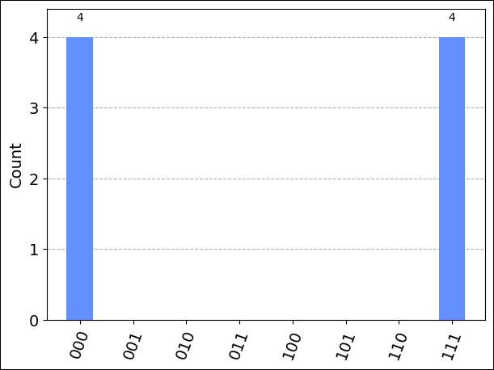
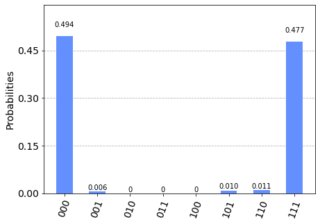

## Load the required imports

First, run the following cell to load the required imports:

```python
from qiskit import QuantumCircuit
from qiskit.visualization import plot_histogram
from qiskit.tools.monitor import job_monitor
from azure.quantum.qiskit import AzureQuantumProvider
```

## Connect to the Azure Quantum service

To connect to the Azure Quantum service, your program will need the resource ID and the
location of your Azure Quantum workspace. Log in to your Azure account,
<https://portal.azure.com>, navigate to your Azure Quantum workspace, and
copy the values from the header.


Paste the values into the following `AzureQuantumProvider` constructor to
create a `provider` object that connects to your Azure Quantum workspace.

```python
provider = AzureQuantumProvider(
  resource_id="",
  location=""
)
```

### List all backends

You can now print all of the quantum computing backends that are
available on your workspace:

```python
print([backend.name() for backend in provider.backends()])
```

```output
['ionq.qpu', 'ionq.simulator', 'honeywell.hqs-lt-s1', 'honeywell.hqs-lt-s1-apival', 'honeywell.hqs-lt-s2', 'honeywell.hqs-lt-s2-apival', 'honeywell.hqs-lt-s1-sim']
```

## Run a simple circuit

First, create a simple Qiskit circuit to run.

```python
# Create a Quantum Circuit acting on the q register
circuit = QuantumCircuit(3, 3)
circuit.name = "Qiskit Sample - 3-qubit GHZ circuit"
circuit.h(0)
circuit.cx(0, 1)
circuit.cx(1, 2)
circuit.measure([0,1,2], [0, 1, 2])

# Print out the circuit
circuit.draw()
```

```html
     ┌───┐          ┌─┐      
q_0: ┤ H ├──■───────┤M├──────
     └───┘┌─┴─┐     └╥┘┌─┐   
q_1: ─────┤ X ├──■───╫─┤M├───
          └───┘┌─┴─┐ ║ └╥┘┌─┐
q_2: ──────────┤ X ├─╫──╫─┤M├
               └───┘ ║  ║ └╥┘
c: 3/════════════════╩══╩══╩═
                     0  1  2 
```

To get a result back quickly, use `provider.get_backend` to create a
`Backend` object to connect to the IonQ Simulator backend:

```python
simulator_backend = provider.get_backend("ionq.simulator")
```

You can now run the program via the Azure Quantum service and get the
result. The following cell submits a job that runs the circuit with
100 shots:

```python
job = simulator_backend.run(circuit, shots=100)
job_id = job.id()
print("Job id", job_id)
```

```output
Job id 00000000-0000-0000-0000-000000000000
```

To monitor job progress, you can use the Qiskit `job_monitor` imported
earlier to keep track of the Job\'s status. Note that this call will
block until the job completes:

```python
job_monitor(job)
```

```output
Job Status: job has successfully run
```

To wait until the job is complete and return the results, run:

```python
result = job.result()
```

This returns a `qiskit.Result` object.

```python
type(result)
```

```output
qiskit.result.result.Result
```

```python
print(result)
```

```output
Result(backend_name='ionq.simulator', backend_version='1', qobj_id='Qiskit Sample - 3-qubit GHZ circuit', job_id='00000000-0000-0000-0000-000000000000', success=True, results=[ExperimentResult(shots=100, success=True, meas_level=2, data=ExperimentResultData(counts={'000': 50, '111': 50}, probabilities={'000': 0.5, '111': 0.5}), header=QobjExperimentHeader(meas_map='[0, 1, 2]', name='Qiskit Sample - 3-qubit GHZ circuit', num_qubits='3', qiskit='True'))])
```

Because this is an object native to the Qiskit package, you can use
Qiskit\'s `result.get_counts` and `plot_histogram` to visualize the
results. To make sure that all possible bitstring labels are represented,
add them to `counts`.

```python
counts = {format(n, "03b"): 0 for n in range(8)}
counts.update(result.get_counts(circuit))
print(counts)
plot_histogram(counts)
```

```output
{'000': 50, '001': 0, '010': 0, '011': 0, '100': 0, '101': 0, '110': 0, '111': 50}
```




## Estimate job cost

Before running a job on the QPU, you can estimate how much it will cost to run. To estimate the cost of running a job on the QPU, run the following script:

```python
cost = (cost_1q * N_1q + cost_2q * N_2q) * num_shots
cost = max(cost, 1.0)
```

`N_1q` is the number of one-qubit gates, `N_2q` is the number of two-qubit gates, `cost_1q` is the cost of running a single one-qubit gate for one shot, `cost_2q` is the cost of running a single two-qubit gate for one shot, and `num_shots` is the number of shots.

For the most current pricing details, see [IonQ Pricing](xref:microsoft.quantum.providers.ionq#pricing), or find your workspace and view pricing options in the "Provider" tab of your workspace via: [aka.ms/aq/myworkspaces](http://aka.ms/aq/myworkspaces).


## Run on IonQ QPU

To connect to real hardware (a [Quantum Processor Unit](xref:microsoft.quantum.target-profiles#quantum-processing-units-qpu-different-profiles) (QPU)), simply
provide the name of the target `"ionq.qpu"` to the `provider.get_backend` method:

```python
qpu_backend = provider.get_backend("ionq.qpu")
```

Submit the circuit to run on Azure Quantum. 

> [!NOTE] 
> The time required to run a circuit on the QPU may vary depending on current queue times.

As before, use `job_monitor` to keep track of the job
status, and `plot_histogram` to plot the results.

```python
# Submit the circuit to run on Azure Quantum
qpu_job = qpu_backend.run(circuit, shots=1024)
job_id = qpu_job.id()
print("Job id", job_id)

# Monitor job progress and wait until complete:
job_monitor(qpu_job)

# Get the job results (this method also waits for the Job to complete):
result = qpu_job.result()
print(result)
counts = {format(n, "03b"): 0 for n in range(8)}
counts.update(result.get_counts(circuit))
print(counts)
plot_histogram(counts)
```

```output
Job id 00000000-0000-0000-0000-000000000000
Job Status: job has successfully run
Result(backend_name='ionq.simulator', backend_version='1', qobj_id='Qiskit Sample - 3-qubit GHZ circuit', job_id='00000000-0000-0000-0000-000000000000', success=True, results=[ExperimentResult(shots=1024, success=True, meas_level=2, data=ExperimentResultData(counts={'0': 505, '1': 6, '2': 1, '3': 1, '4': 1, '5': 10, '6': 11, '7': 488}, probabilities={'0': 0.4932, '1': 0.0059, '2': 0.001, '3': 0.001, '4': 0.001, '5': 0.0098, '6': 0.0117, '7': 0.4766}), header=QobjExperimentHeader(name='Qiskit Sample - 3-qubit GHZ circuit', num_qubits='3', qiskit='True'))])
{'000': 505, '001': 6, '010': 1, '011': 1, '100': 1, '101': 10, '110': 11, '111': 488}
```



