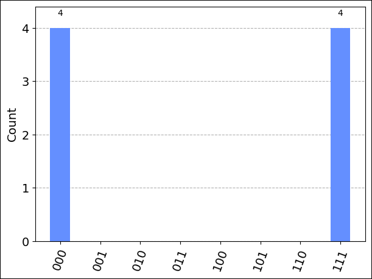

## Prerequisites

For installation details, see [Set up the QDK extension](xref:microsoft.quantum.install-qdk.overview).

- An Azure Quantum workspace in your Azure subscription. To create a workspace, see [Create an Azure Quantum workspace](xref:microsoft.quantum.how-to.workspace).
- A Python environment with [Python and Pip](https://apps.microsoft.com/detail/9NRWMJP3717K) installed.
- VS Code with the [Azure Quantum Development Kit](https://marketplace.visualstudio.com/items?itemName=quantum.qsharp-lang-vscode), [Python](https://marketplace.visualstudio.com/items?itemName=ms-python.python), and [Jupyter](https://marketplace.visualstudio.com/items?itemName=ms-toolsai.jupyter) extensions installed.
- The Azure Quantum `azure-quantum` Python package with the \[qiskit\] tag. 

    ```cmd
    python -m pip install --upgrade azure-quantum[qiskit] qsharp ipykernel 
    ```
    > [!IMPORTANT]
    > Ensure that you have the latest version of Qiskit. For more information, see [Update the azure-quantum Python package](xref:microsoft.quantum.update-qdk#update-the-azure-quantum-python-packages).

    > [!NOTE]
    > If the Jupyter Python kernel `ipykernel` is not detected, VS Code will prompt you to install it.  

## Create a new Jupyter Notebook

1. In VS Code, select **View > Command palette** and select **Create: New Jupyter Notebook**. 
1. In the top-right, VS Code will detect and display the version of Python and the virtual Python environment that was selected for the notebook. If you have multiple Python environments, you may need to select a kernel using the kernel picker in the top right. If no environment was detected, see [Jupyter Notebooks in VS Code](https://code.visualstudio.com/docs/datascience/jupyter-notebooks#_setting-up-your-environment) for setup information. 

## Load the required imports

In the first cell of your notebook, run the following code to load the required imports:

```python
import azure.quantum
from azure.quantum import Workspace 
from qiskit import QuantumCircuit
from qiskit.visualization import plot_histogram
from azure.quantum.qiskit import AzureQuantumProvider
```

## Connect to the Azure Quantum service

To connect to the Azure Quantum service, your need the resource ID and the
location of your Azure Quantum workspace. 

1. Log in to your Azure account, <https://portal.azure.com>,
1. Select your Azure Quantum workspace, and navigate to **Overview**.
1. Copy the parameters in the fields.

    :::image type="content" source="../media/azure-portal-workspace-overview.png" alt-text="Screenshot of Visual Studio Code showing how to expand the overview pane of your Quantum Workspace.":::

Add a new cell in your notebook and use your account information to create [`Workspace`](xref:azure.quantum.Workspace) and  [`AzureQuantumProvider`](xref:azure.quantum.qiskit.AzureQuantumProvider) objects to connect to your Azure Quantum workspace.


```python
workspace = Workspace(  
    resource_id = "", # Add the resourceID of your workspace
    location = "" # Add the location of your workspace (for example "westus")
    )

provider = AzureQuantumProvider(workspace)
```

### List all backends

You can now print all of the quantum computing backends that are
available on your workspace:

```python
print("This workspace's targets:")
for backend in provider.backends():
    print("- " + backend.name())
```

```output
This workspace's targets:
- ionq.qpu
- ionq.qpu.aria-1
- ionq.simulator
- microsoft.estimator
- quantinuum.hqs-lt-s1
- quantinuum.hqs-lt-s1-apival
- quantinuum.hqs-lt-s2
- quantinuum.hqs-lt-s2-apival
- quantinuum.hqs-lt-s1-sim
- quantinuum.hqs-lt-s2-sim
- quantinuum.qpu.h1-1
- quantinuum.sim.h1-1sc
- quantinuum.sim.h1-1e
- rigetti.sim.qvm
- rigetti.qpu.ankaa-9q-3
- rigetti.qpu.ankaa-3
```

## Run a simple circuit

First, create a simple Qiskit circuit to run.

```python
# Create a Quantum Circuit acting on the q register
circuit = QuantumCircuit(3, 3)
circuit.name = "Qiskit Sample - 3-qubit GHZ circuit"
circuit.h(0)
circuit.cx(0, 1)
circuit.cx(1, 2)
circuit.measure([0,1,2], [0, 1, 2])

# Print out the circuit
circuit.draw()
```

```html
     ┌───┐          ┌─┐      
q_0: ┤ H ├──■───────┤M├──────
     └───┘┌─┴─┐     └╥┘┌─┐   
q_1: ─────┤ X ├──■───╫─┤M├───
          └───┘┌─┴─┐ ║ └╥┘┌─┐
q_2: ──────────┤ X ├─╫──╫─┤M├
               └───┘ ║  ║ └╥┘
c: 3/════════════════╩══╩══╩═
                     0  1  2 
```


## Select a target to run your program

### [IonQ](#tab/tabid-ionq)

#### Run on the IonQ simulator

Before running on real hardware, let's test the circuit in the simulator. Use [`get_backend`](xref:azure.quantum.qiskit.AzureQuantumProvider) to create a `Backend` object to connect to the IonQ Simulator backend:

```python
simulator_backend = provider.get_backend("ionq.simulator")
```

IonQ backends support gates from a defined [gateset](https://docs.ionq.com/#section/Supported-Gates), which are compiled to run optimally on the hardware. If your circuit contains gates that aren't in this list, you need to transpile into the supported `gateset` using the `transpile` function provided by Qiskit:

```python
from qiskit import transpile
circuit = transpile(circuit, simulator_backend)
```

The transpile function returns a new circuit object where gates are decomposed into gates that are supported on the specified backend.

You can now run the program via the Azure Quantum service and get the
result. The following cell submits a job that runs the circuit with
100 shots:

```python
job = simulator_backend.run(circuit, shots=8)
job_id = job.id()
print("Job id", job_id)
```

```output
Job id 00000000-0000-0000-0000-000000000000
```

To wait until the job is complete and return the results, run:

```python
result = job.result()
print(result)
```

```output
Result(backend_name='ionq.simulator', backend_version='1', qobj_id='Qiskit Sample - 3-qubit GHZ circuit', job_id='00000000-0000-0000-0000-000000000000', success=True, results=[ExperimentResult(shots=8, success=True, meas_level=2, data=ExperimentResultData(counts={'000': 4, '111': 4}, memory=['000', '000', '000', '000', '111', '111', '111', '111'], probabilities={'000': 0.5, '111': 0.5}), header=QobjExperimentHeader(name='Qiskit Sample - 3-qubit GHZ circuit', num_qubits=3, metadata={}), status=JobStatus.DONE, name='Qiskit Sample - 3-qubit GHZ circuit')], date=None, status=None, header=None, error_data=None)
```

Because the result is an object native to the Qiskit package, you can use
Qiskit\'s `result.get_counts` and `plot_histogram` to visualize the
results. To make sure that all possible bitstring labels are represented,
add them to `counts`.

```python
counts = {format(n, "03b"): 0 for n in range(8)}
counts.update(result.get_counts(circuit))
print(counts)
plot_histogram(counts)
```

```output
{'000': 4, '001': 0, '010': 0, '011': 0, '100': 0, '101': 0, '110': 0, '111': 4}
```


You can also use the `get_memory()` function to display individual shot data from the job

```python
result.get_memory(circuit)
```

```output
['000', '000', '000', '000', '111', '111', '111', '111']
```

> [!NOTE]
> On IonQ targets, if you submit a job with an odd number of shots, the results will be rounded down to the next even number. For example, if you specify 9 shots, the results will display data for 8 shots. 

#### Estimate job cost

Before running a job on the QPU, you should estimate how much it costs to run.

For the most current pricing details, see [IonQ Pricing](xref:microsoft.quantum.providers.ionq#pricing), or find your workspace and view pricing options in the "Provider" tab of your workspace via: [aka.ms/aq/myworkspaces](https://aka.ms/aq/myworkspaces).


#### Run on IonQ QPU

To connect to real hardware (a [Quantum Processor Unit](xref:microsoft.quantum.target-profiles#quantum-processing-units-qpu-different-profiles) (QPU)), simply
provide the name of the target `"ionq.qpu.aria-1"` to the [`get_backend`](xref:azure.quantum.qiskit.AzureQuantumProvider) method:

```python
qpu_backend = provider.get_backend("ionq.qpu.aria-1")
```

Submit the circuit to run on Azure Quantum, get the results, and run `plot_histogram` to plot the results.

> [!NOTE]
> The time required to run a circuit on the QPU may vary depending on current queue times.


```python
# Submit the circuit to run on Azure Quantum
job = qpu_backend.run(circuit, shots=100)
job_id = job.id()
print("Job id", job_id)

# Get the job results (this method waits for the Job to complete):
result = job.result()
print(result)
counts = {format(n, "03b"): 0 for n in range(8)}
counts.update(result.get_counts(circuit))
print(counts)
plot_histogram(counts)
```

```output
Job id 00000000-0000-0000-0000-000000000000
Job Status: job has successfully run
Result(backend_name='ionq.qpu.aria-1', backend_version='1', qobj_id='Qiskit Sample - 3-qubit GHZ circuit', job_id='00000000-0000-0000-0000-000000000000', success=True, results=[ExperimentResult(shots=1024, success=True, meas_level=2, data=ExperimentResultData(counts={'0': 505, '1': 6, '2': 1, '3': 1, '4': 1, '5': 10, '6': 11, '7': 488}, probabilities={'0': 0.4932, '1': 0.0059, '2': 0.001, '3': 0.001, '4': 0.001, '5': 0.0098, '6': 0.0117, '7': 0.4766}), header=QobjExperimentHeader(name='Qiskit Sample - 3-qubit GHZ circuit', num_qubits='3', qiskit='True'))])
{'000': 505, '001': 6, '010': 1, '011': 1, '100': 1, '101': 10, '110': 11, '111': 488}
```


### [Quantinuum](#tab/tabid-quantinuum)

#### Run on the syntax checker 

To test the program before running it on the hardware, first run it on the Quantinuum Syntax Checker. Use the [`get_backend`](xref:azure.quantum.qiskit.AzureQuantumProvider) method to create a `Backend` object to connect to the Quantinuum Syntax Checker backend:

```python
# Get Quantinuum's syntax checker backend:
syntax_backend = provider.get_backend("quantinuum.sim.h1-1sc")
```

You can now run the program via the Azure Quantum service and get the
result. The following cell submits a job that runs the circuit with
eight shots:

```python
# Submit the circuit to run on Azure Quantum
job = syntax_backend.run(circuit, shots=8)
job_id = job.id()
print("Job id", job_id)

# Get the job results (this method waits for the Job to complete):
result = job.result()
print(result)
counts = {format(n, "03b"): 0 for n in range(8)}
counts.update(result.get_counts(circuit))
print(counts)
plot_histogram(counts)
```

```output
Result(backend_name='quantinuum.sim.h1-1sc', backend_version='1', qobj_id='Qiskit Sample - 3-qubit GHZ circuit', job_id='00000000-0000-0000-0000-000000000000', success=True, results=[ExperimentResult(shots=8, success=True, meas_level=2, data=ExperimentResultData(counts={'000': 8}, memory=['000', '000', '000', '000', '000', '000', '000', '000'], probabilities={'000': 1.0}), header=QobjExperimentHeader(name='Qiskit Sample - 3-qubit GHZ circuit', num_qubits=3, metadata={}), status=JobStatus.DONE, name='Qiskit Sample - 3-qubit GHZ circuit')], date=None, status=None, header=None, error_data=None)
{'000': 8, '001': 0, '010': 0, '011': 0, '100': 0, '101': 0, '110': 0, '111': 0}
```


> [!NOTE]
> While the [Quantinuum syntax checker](xref:microsoft.quantum.providers.quantinuum#api-validator) ensures that your code will run successfully on Quantinuum hardware, it also returns 0 for every quantum measurement. For a true quantum measurement, you need to run your circuit on quantum hardware.

You can also use the `get_memory()` function to display individual shot data from the job

```python
result.get_memory(circuit)
```

```output
['000', '000', '000', '000', '000', '000', '000', '000']
```

#### Estimate job cost

Before running a job on the QPU, you should estimate how much it will cost to run.

For the most current pricing details, see [Azure Quantum pricing](xref:microsoft.quantum.providers-pricing#quantinuum), or find your workspace and view pricing options in the **Provider** tab of your workspace via: [aka.ms/aq/myworkspaces](https://aka.ms/aq/myworkspaces).


#### Run on a Quantinuum QPU 

After running successfully on the API validator, you can run your job on one of Quantinuum's hardware processors (a [Quantum Processor Unit](xref:microsoft.quantum.target-profiles#quantum-processing-units-qpu-different-profiles) (QPU)).

> [!NOTE] 
> The time required to run a circuit on the QPU may vary depending on current queue times.

```python
# Get Quantinuum's QPU backend:
qpu_backend = provider.get_backend("quantinuum.qpu.h1-1")
```

```python
# Submit the circuit to run on Azure Quantum
job = qpu_backend.run(circuit, shots=100)
job_id = job.id()
print("Job id", job_id)
```

```python
# Get the job results (this method waits for the Job to complete):
result = job.result()
print(result)
counts = {format(n, "03b"): 0 for n in range(8)}
counts.update(result.get_counts(circuit))
print(counts)
plot_histogram(counts)
```

```output
Result(backend_name='quantinuum.qpu.h1-1', backend_version='1', qobj_id='Qiskit Sample - 3-qubit GHZ circuit', job_id='00000000-0000-0000-0000-000000000000', success=True, results=[ExperimentResult(shots=1024, success=True, meas_level=2, data=ExperimentResultData(counts={'011': 16, '010': 5, '001': 1, '000': 500, '111': 471, '101': 6, '100': 17, '110': 8}, probabilities={'011': 0.015625, '010': 0.0048828125, '001': 0.0009765625, '000': 0.48828125, '111': 0.4599609375, '101': 0.005859375, '100': 0.0166015625, '110': 0.0078125}), header=QobjExperimentHeader(name='Qiskit Sample - 3-qubit GHZ circuit'))])
{'000': 500, '001': 1, '010': 5, '011': 16, '100': 17, '101': 6, '110': 8, '111': 471}
```


### [Rigetti](#tab/tabid-rigetti)

#### Run on the QVM simulator

Use the `provider.get_backend` method to create a `Backend` object to connect to the Rigetti QVM simulator backend:

```python
# Get Rigetti's QVM simulator backend:
qvm_backend = provider.get_backend("rigetti.sim.qvm")
```

You can now run the program via the Azure Quantum service and get the
result. The following cell submits a job that runs the circuit with
eight shots:

```python
# Submit the circuit to run on Azure Quantum
job = qvm_backend.run(circuit, shots=8)
job_id = job.id()
print("Job id", job_id)

# Get the job results (this method waits for the Job to complete):
result = job.result()
print(result)
counts = {format(n, "03b"): 0 for n in range(8)}
counts.update(result.get_counts(circuit))
print(counts)
plot_histogram(counts)
```

```output
Result(backend_name='rigetti.sim.qvm', backend_version='1', qobj_id='Qiskit Sample - 3-qubit GHZ circuit', job_id='00000000-0000-0000-0000-000000000000', success=True, results=[ExperimentResult(shots=8, success=True, meas_level=2, data=ExperimentResultData(counts={'000': 4, '111': 4}, memory=['000', '111', '111', '000', '000', '000', '111', '111'], probabilities={'000': 0.5, '111': 0.5}), header=QobjExperimentHeader(name='Qiskit Sample - 3-qubit GHZ circuit', num_qubits=3, metadata={}), status=JobStatus.DONE, name='Qiskit Sample - 3-qubit GHZ circuit')], date=None, status=None, header=None, error_data=None)
{'000': 4, '001': 0, '010': 0, '011': 0, '100': 0, '101': 0, '110': 0, '111': 4}

```



You can also use the `get_memory()` function to display individual shot data from the job

```python
result.get_memory(circuit)
```

```output
['000', '111', '111', '000', '000', '000', '111', '111']
```

***

> [!IMPORTANT]
> Submitting multiple circuits on a single job is currently not supported. As a workaround you can call the `backend.run` method to submit each circuit asynchronously, then fetch the results of each job. For example:
>
> ```python
> jobs = []
> for circuit in circuits:
>     jobs.append(backend.run(circuit, shots=N))
> 
> results = []
> for job in jobs:
>     results.append(job.result())
>```
