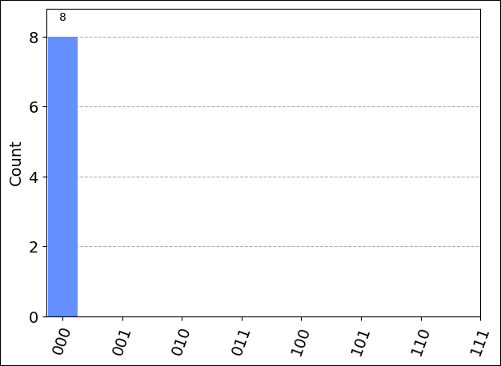
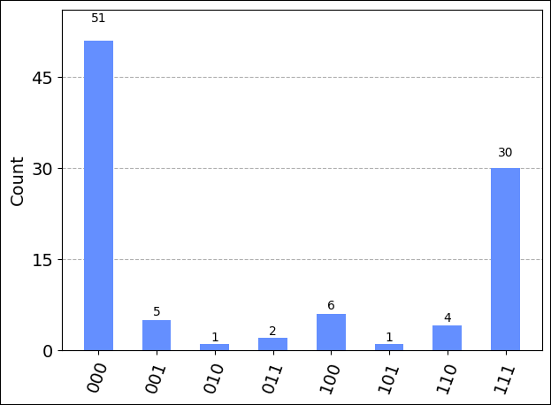

## Prerequisites

- An Azure account with an active subscription. If you don’t have an Azure account, register for free and sign up for a [pay-as-you-go subscription](https://azure.microsoft.com/pricing/purchase-options/pay-as-you-go).
- An Azure Quantum workspace. For more information, see [Create an Azure Quantum workspace](xref:microsoft.quantum.how-to.workspace).

## Create a new notebook in your workspace

1. Log in to the [Azure portal](https://portal.azure.com/) and select the workspace you created in the previous step.
1. In the left blade, select **Notebooks**.
1. Click **My Notebooks** and click **Add New**.
1. Type a name for the file, for example *Qiskit.ipynb*, and click **Create file**. 

When your new notebook opens, it automatically creates the code for the first cell, based on your subscription and workspace information.

```python
from azure.quantum import Workspace
workspace = Workspace ( 
    resource_id = "", # Add your resource_id 
    location = ""  # Add your workspace location (for example, "westus") 
)
```

> [!NOTE]
> Unless otherwise noted, you should run each cell in order as you create it to avoid any compilation issues. 

Click the triangular "play" icon to the left of the cell to run the code. 

## Load the required imports

First, you'll need to import some additional modules. 

Click **+ Code** to add a new cell, then add and run the following code:

```python
from qiskit import QuantumCircuit
from qiskit.visualization import plot_histogram
from qiskit.tools.monitor import job_monitor
from azure.quantum.qiskit import AzureQuantumProvider
```

## Connect to the Azure Quantum service

Next, create an `AzureQuantumProvider` object using the `workspace` object from the previous cell to connect to your Azure Quantum workspace.  Add a new cell with the following code:

```python
provider = AzureQuantumProvider(workspace)
```

## Define a simple circuit

In a new cell, create a `circuit` object. This example is a simple quantum random bit generator. Add the following code to define and display the circuit:

```python
# Create a Quantum Circuit acting on the q register
circuit = QuantumCircuit(3, 3)
circuit.name = "Qiskit Sample - 3-qubit GHZ circuit"
circuit.h(0)
circuit.cx(0, 1)
circuit.cx(1, 2)
circuit.measure([0, 1, 2], [0, 1, 2])

# Print out the circuit
circuit.draw()
```

```html
     ┌───┐          ┌─┐      
q_0: ┤ H ├──■───────┤M├──────
     └───┘┌─┴─┐     └╥┘┌─┐   
q_1: ─────┤ X ├──■───╫─┤M├───
          └───┘┌─┴─┐ ║ └╥┘┌─┐
q_2: ──────────┤ X ├─╫──╫─┤M├
               └───┘ ║  ║ └╥┘
c: 3/════════════════╩══╩══╩═
                     0  1  2 
```

## List all targets

You can now display all of the quantum computing targets, or backends, that are
available in your workspace. Add a new cell and run the following line:

```python
print("This workspace's targets:")
for backend in provider.backends():
    print("- " + backend.name())
```

```output
This workspace's targets:
- ionq.qpu
- ionq.simulator
- ionq.qpu.aria-1
- microsoft.estimator
- quantinuum.qpu.h1-1
- quantinuum.sim.h1-1sc
- quantinuum.sim.h1-1e
- rigetti.sim.qvm
- rigetti.qpu.ankaa-2
- rigetti.qpu.ankaa-9q-1
```

## Select a target to run your program

### [IonQ](#tab/tabid-ionq)

To check your code before running it on actual quantum hardware, you can use the IonQ quantum simulator, `ionq.simulator`.

Add a new cell and create an object to represent the IonQ quantum simulator target:

```python
# Get IonQ quantum simulator target:
simulator_backend = provider.get_backend("ionq.simulator")
```

#### Run on the IonQ simulator 

To run your circuit on the simulator, add the following code. This example use the `run` method of the target to submit your job, and then monitors the job status. 

```python
# Submit the circuit to run on Azure Quantum
job = simulator_backend.run(circuit, shots=100)
job_id = job.id()
print("Job id", job_id)

# Monitor job progress and wait until complete:
job_monitor(job)
```

The job status is displayed in realtime:

```output
Job id 7d909574-98d4-11ec-b382-00155d957f5d
Job status: job is queued
Job status: job is actively running
Job status: job has successfully run
```

When the job successfully runs, get the job results and display them:

```python
# Get the job results:
result = job.result()
print(result)
```

```output
Result(backend_name='ionq.simulator', backend_version='1', qobj_id='Qiskit Sample - 3-qubit GHZ circuit', job_id='7d909574-98d4-11ec-b382-00155d957f5d', success=True, results=[ExperimentResult(shots=100, success=True, meas_level=2, data=ExperimentResultData(counts=defaultdict(<class 'int'>, {'000': 50, '111': 50}), probabilities=defaultdict(<class 'int'>, {'000': 0.5, '111': 0.5})), header=QobjExperimentHeader(meas_map='[0, 1, 2]', name='Qiskit Sample - 3-qubit GHZ circuit', num_qubits='3', qiskit='True'))])
```

Because this `result` type is an object native to the Qiskit package, you can use
Qiskit\'s `result.get_counts` and `plot_histogram` to visualize the
results. To make sure that all possible bitstring labels are represented,
add them to `counts`.

```python
counts = {format(n, "03b"): 0 for n in range(8)}
counts.update(result.get_counts(circuit))
print(counts)
plot_histogram(counts)
```

```output
{'000': 50, '001': 0, '010': 0, '011': 0, '100': 0, '101': 0, '110': 0, '111': 50}
```


#### Estimate job cost

Before running a job on actual quantum hardware, or a [quantum processing unit](xref:microsoft.quantum.target-profiles) (QPU), you can estimate how much it costs to run. 

First, get the list of available providers again:

```python
print("This workspace's targets:")
for backend in provider.backends():
    print("- " + backend.name())
```

```output
This workspace's targets:
- ionq.qpu
- ionq.simulator
- ionq.qpu.aria-1
- microsoft.estimator
- quantinuum.qpu.h1-1
- quantinuum.sim.h1-1sc
- quantinuum.sim.h1-1e
- rigetti.sim.qvm
- rigetti.qpu.ankaa-2
- rigetti.qpu.ankaa-9q-1
```

Next, create an object to represent the [IonQ quantum computer](xref:microsoft.quantum.providers.ionq#quantum-computer):

```python
qpu_backend = provider.get_backend("ionq.qpu")
```

To estimate the cost of running a job on the QPU, add and run a new cell using the `estimate_cost` method of the target:

```python
cost = qpu_backend.estimate_cost(circuit, shots=100)

print(f"Estimated cost: {cost.estimated_total}")
```

This displays the estimated cost in USD.

For the most current pricing details, see [IonQ Pricing](xref:microsoft.quantum.providers-pricing#ionq), or find your workspace and view pricing options in the **Providers** blade of your workspace.

#### Run on IonQ QPU

After you run your job successfully on the IonQ simulator and estimate the QPU cost, it's time to run your circuit on the hardware. 

> [!NOTE] 
> The time required to run a circuit on the QPU varies depending on current queue times. You can view the average queue time for a target by selecting the **Providers** blade of your workspace.

Use the same `run` method and operations that you used previously with the API Validator to submit and monitor your job:

```python
# Submit the circuit to run on Azure Quantum
job = qpu_backend.run(circuit, shots=1024)
job_id = job.id()
print("Job id", job_id)

# Monitor job progress and wait until complete:
job_monitor(job)
```

```output
Job id 54e8c740-98d9-11ec-b382-00155d957f5d
Job Status: job has successfully run
```

When the job finishes, get the job results as before and display them in a chart:

```python
result = job.result()
print(result)
counts = {format(n, "03b"): 0 for n in range(8)}
counts.update(result.get_counts(circuit))
print(counts)
plot_histogram(counts)
```

```output
Job id 910b5ac8-98cd-11ec-b3ba-00155d5528cf
Job Status: job has successfully run
Result(backend_name='ionq.simulator', backend_version='1', qobj_id='Qiskit Sample - 3-qubit GHZ circuit', job_id='Job id 54e8c740-98d9-11ec-b382-00155d957f5d', success=True, results=[ExperimentResult(shots=1024, success=True, meas_level=2, data=ExperimentResultData(counts={'0': 505, '1': 6, '2': 1, '3': 1, '4': 1, '5': 10, '6': 11, '7': 488}, probabilities={'0': 0.4932, '1': 0.0059, '2': 0.001, '3': 0.001, '4': 0.001, '5': 0.0098, '6': 0.0117, '7': 0.4766}), header=QobjExperimentHeader(name='Qiskit Sample - 3-qubit GHZ circuit', num_qubits='3', qiskit='True'))])
{'000': 505, '001': 6, '010': 1, '011': 1, '100': 1, '101': 10, '110': 11, '111': 488}
```


### [Quantinuum](#tab/tabid-quantinuum)

To check your code before running it on actual quantum hardware, you can use one of the Quantinuum Syntax Checkers, `quantinuum.sim.h1-1sc`.

Add a new cell and create an object to represent the Quantinuum Syntax Checker target:

```python
# Get Quantinuum's Syntax Checker target:
apival_backend = provider.get_backend("quantinuum.sim.h1-1sc")
```

#### Run on the Syntax Checker

To run your circuit on the Syntax Checker, add the following code, which uses the `run` method of the target to submit your job, and then monitors the job status. 

```python
# Submit the circuit to run on Azure Quantum
job = apival_backend.run(circuit, shots=100)
job_id = job.id()
print("Job id", job_id)

# Monitor job progress and wait until complete:
job_monitor(job)
```

The job status is displayed in real time:

```output
Job id 89511b08-9691-11ec-be32-00155d00ae89
Job status: job is queued
Job status: job is actively running
Job status: job has successfully run
```

When the job has successfully run, get the job results and display them:

```python
# Get the job results:
result = job.result()
print(result)
```

```output
Result(backend_name='quantinuum.sim.h1-1sc', backend_version='1', qobj_id='Qiskit Sample - 3-qubit GHZ circuit', job_id='89511b08-9691-11ec-be32-00155d00ae89', success=True, results=[ExperimentResult(shots=100, success=True, meas_level=2, data=ExperimentResultData(counts={'000': 100}, probabilities={'000': 1.0}), header=QobjExperimentHeader(name='Qiskit Sample - 3-qubit GHZ circuit'))])
```

Because this `result` type is an object native to the Qiskit package, you can use
Qiskit\'s `result.get_counts` and `plot_histogram` to visualize the
results. To make sure that all possible bitstring labels are represented,
add them to `counts`.

```python
counts = {format(n, "03b"): 0 for n in range(8)}
counts.update(result.get_counts(circuit))
print(counts)
plot_histogram(counts)
```

```output
{'000': 100, '001': 0, '010': 0, '011': 0, '100': 0, '101': 0, '110': 0, '111': 0}
```



Looking at the histogram, you may notice that the random number generator returned 0 every time, which isn't very random. This is because that, while the Syntax Checker ensures that your code will run successfully on Quantinuum hardware, it also returns 0 for every quantum measurement. For a true random number generator, you need to run your circuit on quantum hardware.

#### Estimate job cost

Before running a job on actual quantum hardware, or a [quantum processing unit](xref:microsoft.quantum.target-profiles) (QPU), you can estimate how much it will cost to run. 

First, get the list of available providers again:

```python
print("This workspace's targets:")
for backend in provider.backends():
    print("- " + backend.name())
```

```output
This workspace's targets:
- ionq.qpu
- ionq.simulator
- ionq.qpu.aria-1
- microsoft.estimator
- quantinuum.qpu.h1-1
- quantinuum.sim.h1-1sc
- quantinuum.sim.h1-1e
- rigetti.sim.qvm
- rigetti.qpu.ankaa-2
- rigetti.qpu.ankaa-9q-1
```


Next, create an object to represent the [Quantinuum System Model H1](xref:microsoft.quantum.providers.quantinuum#system-model-h1):

```python
qpu_backend = provider.get_backend("quantinuum.qpu.h1-1")
```

To estimate the cost of running a job on the QPU, add and run a new cell using the `estimate_cost` method of the target:

```python
cost = qpu_backend.estimate_cost(circuit, shots=100)

print(f"Estimated cost: {cost.estimated_total}")
```

```output
Estimated cost: 5.72
```

The output displays the estimated cost in H-System Quantum Credits (HQCs).

For the most current pricing details, see [Azure Quantum pricing](xref:microsoft.quantum.providers-pricing#quantinuum), or view pricing options in the **Providers** blade of your workspace. To see your current credit status and usage, select **Credits and quotas**.

#### Run on a Quantinuum QPU 

After running your circuit successfully on the Syntax Checker and estimating the QPU cost, it's time to run it on the hardware. 

> [!NOTE] 
> The time required to run a circuit on the QPU depends on current queue times. You can view the average queue time for a target by selecting the **Providers** blade of your workspace.

Use the same `run` method and operations that you used previously with the Syntax Checker to submit and monitor your job:

```python
# Submit the circuit to run on Azure Quantum
job = qpu_backend.run(circuit, shots=100)
job_id = job.id()
print("Job id", job_id)

# Monitor job progress and wait until complete:
job_monitor(job)
```

```output
Job id 48282d18-9c15-11ec-bfbd-00155d6373ba
Job Status: job has successfully run
```

When the job has successfully run, get the job results as before and display them in a histogram:

```python
result = job.result()
print(result)
counts = {format(n, "03b"): 0 for n in range(8)}
counts.update(result.get_counts(circuit))
print(counts)
plot_histogram(counts)
```

You can see that the results now are roughly divided between 0 and 1. 

```output
Result(backend_name='quantinuum.qpu.h1-1', backend_version='1', qobj_id='Qiskit Sample - 3-qubit GHZ circuit', job_id='48282d18-9c15-11ec-bfbd-00155d6373ba', success=True, results=[ExperimentResult(shots=100, success=True, meas_level=2, data=ExperimentResultData(counts={'111': 53, '101': 1, '000': 46}, probabilities={'111': 0.53, '101': 0.01, '000': 0.46}), header=QobjExperimentHeader(name='Qiskit Sample - 3-qubit GHZ circuit'))])
{'000': 46, '001': 0, '010': 0, '011': 0, '100': 0, '101': 1, '110': 0, '111': 53}
```


### [Rigetti](#tab/tabid-rigetti)

To check your code before running it on actual quantum hardware, you can use the Rigetti quantum simulator, `rigetti.sim.qvm`.

Add a new cell and create an object to represent the Rigetti quantum simulator target:

```python
# Get Rigetti quantum simulator target:
simulator_backend = provider.get_backend("rigetti.sim.qvm")
```

#### Run on the Rigetti simulator 

To run your circuit on the simulator, add the following code. This example uses the `run` method of the target to submit your job, and then monitors the job status. 

```python
# Submit the circuit to run on Azure Quantum
job = simulator_backend.run(circuit, shots=100)
job_id = job.id()
print("Job id", job_id)

# Monitor job progress and wait until complete:
job_monitor(job)
```

The job status is displayed in realtime:

```output
Job id 5de5e2a0-39e3-11ed-bd56-00155d76e336
Job status: job is queued
Job status: job is actively running
Job status: job has successfully run
```

When the job successfully runs, get the job results and display them:

```python
# Get the job results:
result = job.result()
print(result)
```

```output
Result(backend_name='rigetti.sim.qvm', backend_version='1', qobj_id='Qiskit Sample - 3-qubit GHZ circuit', job_id='5de5e2a0-39e3-11ed-bd56-00155d76e336', success=True, results=[ExperimentResult(shots=100, success=True, meas_level=2, data=ExperimentResultData(counts={'[0, 0, 0]': 54, '[1, 1, 1]': 46}, probabilities={'[0, 0, 0]': 0.59, '[1, 1, 1]': 0.41}), header=QobjExperimentHeader(metadata=None, name='Qiskit Sample - 3-qubit GHZ circuit', num_qubits='3', qiskit='True'))])
```

Because this `result` type is an object native to the Qiskit package, you can use
Qiskit\'s `result.get_counts` and `plot_histogram` to visualize the
results. To make sure that all possible bitstring labels are represented,
add them to `counts`.

```python
counts = {format(n, "03b"): 0 for n in range(8)}
counts.update(result.get_counts(circuit))
print(counts)
plot_histogram(counts)
```

```output
{'000': 50, '001': 0, '010': 0, '011': 0, '100': 0, '101': 0, '110': 0, '111': 50}
```


#### Run on Rigetti QPU

After you run your circuit successfully on the Rigetti simulator, it's time to run your circuit on the hardware. 

> [!NOTE] 
> The time required to run a circuit on the QPU varies depending on current queue times. You can view the average queue time for a target by selecting the **Providers** blade of your workspace.

First, get the list of available providers again:

```python
print("This workspace's targets:")
for backend in provider.backends():
    print("- " + backend.name())
```

```output
This workspace's targets:
- ionq.qpu
- ionq.simulator
- ionq.qpu.aria-1
- microsoft.estimator
- quantinuum.qpu.h1-1
- quantinuum.sim.h1-1sc
- quantinuum.sim.h1-1e
- rigetti.sim.qvm
- rigetti.qpu.ankaa-2
- rigetti.qpu.ankaa-9q-1
```

Next, create an object to represent the [Rigetti quantum computer](xref:microsoft.quantum.providers.rigetti#quantum-computers):

```python
qpu_backend = provider.get_backend("rigetti.qpu.ankaa-2")
```

Use the same `run` method and operations that you used previously with the Rigetti quantum simulator to submit and monitor your job:

```python
# Submit the circuit to run on Azure Quantum
job = qpu_backend.run(circuit, shots=1024)
job_id = job.id()
print("Job id", job_id)

# Monitor job progress and wait until complete:
job_monitor(job)
```

```output
Job id 54e8c740-98d9-11ec-b382-00155d957f5d
Job Status: job has successfully run
```

When the job has successfully run, get the job results as before and display them in a chart:

```python
result = job.result()
print(result)
counts = {format(n, "03b"): 0 for n in range(8)}
counts.update(result.get_counts(circuit))
print(counts)
plot_histogram(counts)
```

```output
Job id cd4800f4-39e5-11ed-bd56-00155d76e336
Job Status: job has successfully run
Result(backend_name='rigetti.qpu.ankaa-2', backend_version='1', qobj_id='Qiskit Sample - 3-qubit GHZ circuit', job_id='cd4800f4-39e5-11ed-bd56-00155d76e336', success=True, results=[ExperimentResult(shots=1024, success=True, meas_level=2, data=ExperimentResultData(counts={'[0, 0, 0]': 415.0, '[1, 1, 1]': 280.0, '[1, 1, 0]': 103.0, '[0, 1, 1]': 83.0, '[1, 0, 1]': 8.0, '[0, 1, 0]': 36.0, '[1, 0, 0]': 74.0, '[0, 0, 1]': 25.0}, probabilities={'[0, 0, 0]': 0.4052734375, '[1, 1, 1]': 0.2734375, '[1, 1, 0]': 0.1005859375, '[0, 1, 1]': 0.0810546875, '[1, 0, 1]': 0.0078125, '[0, 1, 0]': 0.03515625, '[1, 0, 0]': 0.072265625, '[0, 0, 1]': 0.0244140625}), header=QobjExperimentHeader(metadata=None, name='Qiskit Sample - 3-qubit GHZ circuit', num_qubits='3', qiskit='True'))])
{'000': 0, '001': 0, '010': 0, '011': 0, '100': 0, '101': 0, '110': 0, '111': 0, '[0, 0, 0]': 415.0, '[1, 1, 1]': 280.0, '[1, 1, 0]': 103.0, '[0, 1, 1]': 83.0, '[1, 0, 1]': 8.0, '[0, 1, 0]': 36.0, '[1, 0, 0]': 74.0, '[0, 0, 1]': 25.0}
```



***
