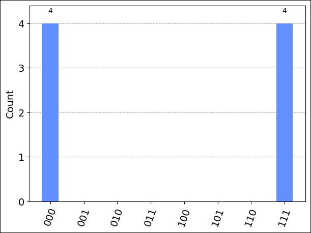
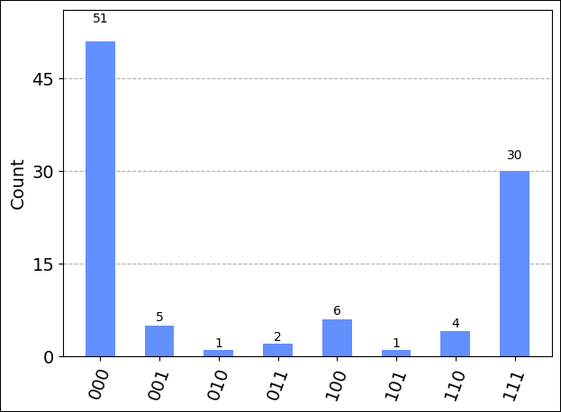

## Select a target to run your program

To check your code before running it on actual quantum hardware, you can use the Rigetti quantum simulator, `rigetti.sim.qvm`.

Add a new cell and create an object to represent the Rigetti quantum simulator target:

```python
# Get Rigetti quantum simulator target:
simulator_backend = provider.get_backend("rigetti.sim.qvm")
```

## Run on the Rigetti simulator 

To run your circuit on the simulator, add the following code which uses the `run` method of the target to submit your job, and then monitors the job status. 

```python
# Submit the circuit to run on Azure Quantum
job = simulator_backend.run(circuit, shots=100)
job_id = job.id()
print("Job id", job_id)

# Monitor job progress and wait until complete:
job_monitor(job)
```

The job status is displayed in realtime:

```output
Job id 5de5e2a0-39e3-11ed-bd56-00155d76e336
Job status: job is queued
Job status: job is actively running
Job status: job has successfully run
```

When the job has successfully run, get the job results and display them:

```python
# Get the job results:
result = job.result()
print(result)
```

```output
Result(backend_name='rigetti.sim.qvm', backend_version='1', qobj_id='Qiskit Sample - 3-qubit GHZ circuit', job_id='5de5e2a0-39e3-11ed-bd56-00155d76e336', success=True, results=[ExperimentResult(shots=100, success=True, meas_level=2, data=ExperimentResultData(counts={'[0, 0, 0]': 54, '[1, 1, 1]': 46}, probabilities={'[0, 0, 0]': 0.59, '[1, 1, 1]': 0.41}), header=QobjExperimentHeader(metadata=None, name='Qiskit Sample - 3-qubit GHZ circuit', num_qubits='3', qiskit='True'))])
```

Because this `result` type is an object native to the Qiskit package, you can use
Qiskit\'s `result.get_counts` and `plot_histogram` to visualize the
results. To make sure that all possible bitstring labels are represented,
add them to `counts`.

```python
counts = {format(n, "03b"): 0 for n in range(8)}
counts.update(result.get_counts(circuit))
print(counts)
plot_histogram(counts)
```

```output
{'000': 50, '001': 0, '010': 0, '011': 0, '100': 0, '101': 0, '110': 0, '111': 50}
```



<!---
## Estimate job cost

Before running a job on actual quantum hardware, or a [quantum processing unit](xref:microsoft.quantum.target-profiles) (QPU), you can estimate how much it will cost to run. 

First, get the list of available providers again:

```python
print("This workspace's targets:")
for backend in provider.backends():
    print("- " + backend.name())
```

```output
This workspace's targets:
- ionq.qpu
- ionq.simulator
- quantinuum.hqs-lt-s1
- quantinuum.hqs-lt-s1-apival
- quantinuum.hqs-lt-s2
- quantinuum.hqs-lt-s2-apival
- quantinuum.hqs-lt-s1-sim
- quantinuum.hqs-lt-s2-sim
- rigetti.sim.qvm
- rigetti.qpu.aspen-11
- rigetti.qpu.aspen-m-2
```

Next, create an object to represent the [Rigetti quantum computer](xref:microsoft.quantum.providers.rigetti#quantum-computers):

```python
qpu_backend = provider.get_backend("rigetti.qpu.aspen-11")
```

To estimate the cost of running a job on the QPU, add and run a new cell using the `estimate_cost` method of the target:

```python
cost = qpu_backend.estimate_cost(circuit, shots=100)

print(f"Estimated cost: {cost.estimated_total}")
```

This displays the estimated cost in USD.

For the most current pricing details, see [Rigetti Pricing](xref:microsoft.quantum.providers-pricing#rigetti), or find your workspace and view pricing options in the **Providers** blade of your workspace.

--->

## Run on Rigetti QPU

After running successfully on the Rigetti simulator, it's time to run your circuit on the hardware. 

> [!NOTE] 
> The time required to run a circuit on the QPU varies depending on current queue times. You can view the average queue time for a target by selecting the **Providers** blade of your workspace.

Use the same `run` method and operations that you used previously with the API Validator to submit and monitor your job:

```python
# Submit the circuit to run on Azure Quantum
job = qpu_backend.run(circuit, shots=1024)
job_id = job.id()
print("Job id", job_id)

# Monitor job progress and wait until complete:
job_monitor(job)
```

```output
Job id 54e8c740-98d9-11ec-b382-00155d957f5d
Job Status: job has successfully run
```

When the job has successfully run, get the job results as before and display them in a chart:

```python
result = job.result()
print(result)
counts = {format(n, "03b"): 0 for n in range(8)}
counts.update(result.get_counts(circuit))
print(counts)
plot_histogram(counts)
```

```output
Job id cd4800f4-39e5-11ed-bd56-00155d76e336
Job Status: job has successfully run
Result(backend_name='rigetti.qpu.aspen-11', backend_version='1', qobj_id='Qiskit Sample - 3-qubit GHZ circuit', job_id='cd4800f4-39e5-11ed-bd56-00155d76e336', success=True, results=[ExperimentResult(shots=1024, success=True, meas_level=2, data=ExperimentResultData(counts={'[0, 0, 0]': 415.0, '[1, 1, 1]': 280.0, '[1, 1, 0]': 103.0, '[0, 1, 1]': 83.0, '[1, 0, 1]': 8.0, '[0, 1, 0]': 36.0, '[1, 0, 0]': 74.0, '[0, 0, 1]': 25.0}, probabilities={'[0, 0, 0]': 0.4052734375, '[1, 1, 1]': 0.2734375, '[1, 1, 0]': 0.1005859375, '[0, 1, 1]': 0.0810546875, '[1, 0, 1]': 0.0078125, '[0, 1, 0]': 0.03515625, '[1, 0, 0]': 0.072265625, '[0, 0, 1]': 0.0244140625}), header=QobjExperimentHeader(metadata=None, name='Qiskit Sample - 3-qubit GHZ circuit', num_qubits='3', qiskit='True'))])
{'000': 0, '001': 0, '010': 0, '011': 0, '100': 0, '101': 0, '110': 0, '111': 0, '[0, 0, 0]': 415.0, '[1, 1, 1]': 280.0, '[1, 1, 0]': 103.0, '[0, 1, 1]': 83.0, '[1, 0, 1]': 8.0, '[0, 1, 0]': 36.0, '[1, 0, 0]': 74.0, '[0, 0, 1]': 25.0}
```



