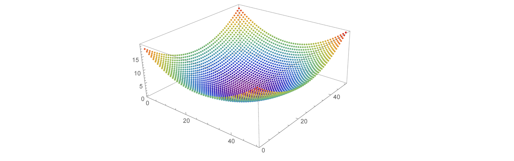
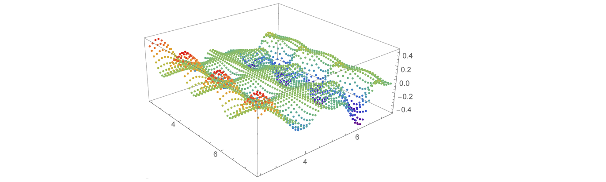

# What is optimization?

At its simplest, optimization is just the process of selecting the best solution to a problem from a set of possible options.

The *best* solution can be defined in many ways: it could be the option with the lowest cost, the quickest runtime, or perhaps the lowest environmental impact. To keep things simple, *best* is usually defined as a cost to be minimized. If you wanted to maximize the cost instead (for example, if you wanted to maximize energy output from a solar cell), all you would need to do is multiply the cost by negative one and then minimize it.

To understand optimization problems, you first need to learn some terminology:

- [Cost function](xref:microsoft.quantum.optimization.concepts.overview.key-concepts): This is the way that the cost varies as a function of the system configuration. It is a mathematical function to be minimized. 
- Search space: This is the space that contains all the feasible solutions to the optimization problem. Each point in this search space is a valid solution to the problem. The lowest point, which corresponds to the lowest cost solution, is called the *global minimum*.
- 
Together, the cost function and the search space are often referred to as an *optimization landscape*. In the case of a problem that involves two continuous variables, the analogy to a landscape is quite direct.

Let's explore a few landscapes and see which are good candidates for quantum-inspired optimization.

## Optimization landscapes

### Smooth landscape
Consider the following plot of a cost function of two continuous variables, which looks like a single, smooth valley:

This kind of problem is easily solved with techniques such as gradient descent, where you begin from an initial starting point and greedily move to any solution with a lower cost. After a few moves, the solution converges to the global minimum. The global minimum is the lowest point in the optimization landscape.

## Structured landscape
Consider the following plot of a cost function of two continuous variables where the landscape is rugged, with many hills and valleys:

In this scenario, one of the greatest challenges is to avoid getting stuck at any of the sub-optimal local minima. A rugged landscape can have multiple valleys. Each of these valleys has a lowest point, which is a local minimum. One of these points will be the lowest of them all, and that point is known as the global minimum.

Such rugged landscapes present situations where quantum-inspired optimization can outperform other techniques.

### Scattered landscape
The following plot corresponds to a random, unstructured landscape: 

In these cases, where the solutions are completely random, there is no optimization algorithm that can improve on a brute force search.

## Problem configuration

Usually an optimization problem involves lots of variables that can interact in many ways to influence the final cost. A particular arrangement of the variables is called the *configuration* of the problem.

Because there are so many possible configurations to choose from, it is sometimes difficult to identify the best solution, particularly when the problem space is very large. It can be easy to get stuck in a local optimum. Some examples of local optima are shown on the following graph, along with the global optimum - the lowest cost configuration our system can adopt.

The goal of the optimization is to find the minimum point on this cost function (or as close to the minimum point as possible, given a reasonable amount of time).

Consider the following example: traffic minimization. The aim of this optimization task is to reduce congestion in a road system to reduce the amount of time users spend waiting in traffic.

Each configuration represents a different combination of routes assigned to the vehicles in the system. The cost is the overall traffic level (or congestion level), which is what we wish to minimize.

This graph highlights some examples of different system configurations, each of which has a different cost value. We have visualized the cost here using color: the redder the road segment, the higher the traffic level and therefore the greater the cost. Conversely, greener road segments have fewer vehicles simultaneously occupying them and therefore lower traffic and cost values.
