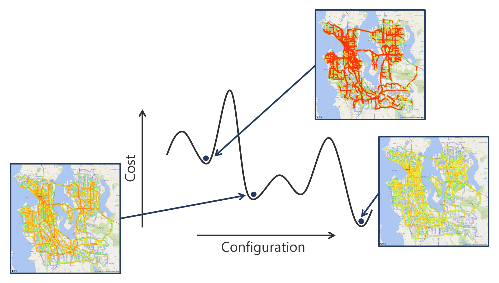

# Introduction to optimization

At its simplest, optimization is just the process of selecting the best choice from a set of possible options.

We can define *best* in many ways: it could be the option with the lowest cost, the quickest runtime or perhaps the lowest environmental impact. To keep things simple, we usually just refer to this definition of best as a cost to be minimized. If we wanted to maximize the cost instead (for example, if we wanted to maximize energy output from a solar cell), all we would need to do is multiply the cost by negative one and then minimize it.

Usually when we say we have an optimization problem, we mean we have a pretty complicated one, where lots of variables can interact in many ways to influence the final cost. We call a particular arrangement of the variables the *configuration* of the problem.

Because there are so many possible configurations to choose from, it is sometimes very difficult to identify the best solution, particularly when the problem space is very large. It can be easy to get stuck in a local optimum. Some examples of local optima are shown on the graph below, as well as the global optimum - the lowest cost configuration our system can adopt.

The way the cost varies as a function of the system configuration gives us what we call the *cost function* - the line traced on our graph. The goal of our optimization is to find the minimum point on this cost function (or as close to the minimum point as possible, given a reasonable amount of time).

Let's illustrate this with an example: traffic minimization. The aim of this optimization task is to reduce congestion in a road system to reduce the amount of time users spend waiting in traffic.

Each configuration represents a different combination of routes assigned to the vehicles in the system. The cost is the overall traffic level (or congestion level), which is what we wish to minimize.

The graph above highlights some examples of different system configurations, each of which has a different cost value. We have visualized the cost here using color: the redder the road segment, the higher the traffic level and therefore the greater the cost. Conversely, greener road segments have fewer vehicles simultaneously occupying them and therefore lower traffic and cost values.
