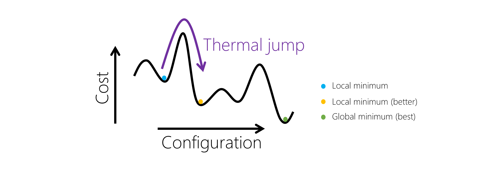
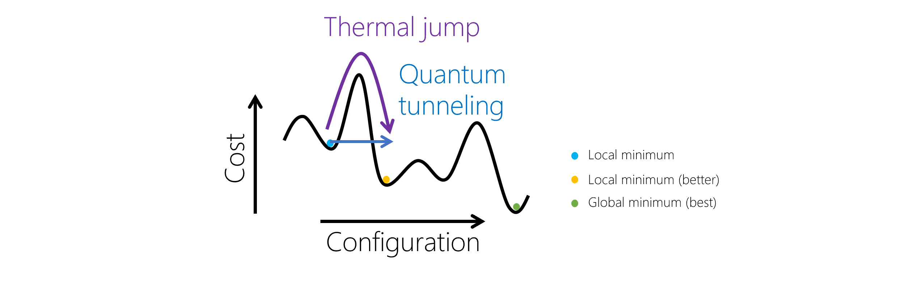

# What is quantum-inspired optimization?

Quantum-inspired optimization is a method that's based on emulating quantum tunneling. A number of techniques have been developed to simulate this type of physics, and one such approach uses a concept from quantum physics known as [the adiabatic theorem](https://wikipedia.org/wiki/Adiabatic_theorem).

Quantum-inspired algorithms are classical algorithms where you classically emulate the essential quantum phenomena that provide the speedup. There are many types of quantum-inspired algorithms - one commonly used algorithm is based on a computational model called *adiabatic quantum computing*. This approach uses a concept from quantum physics known as the adiabatic theorem. When you apply that theorem to solve a problem, you:

- First prepare a system and initialize it to its lowest energy state. For a simple system, one which is completely understood, this is easy to do.
- Next, slowly transform that system into a more complex one that describes the problem you are trying to solve. The adiabatic theorem states that, as long as this transformation happens slowly enough, the system has time to adapt and will stay in that lowest energy configuration. When we're done with our transformations, we've solved our problem.

A good analogy of this is to imagine you have a glass of water. If you move that glass slowly across a table, the contents won't spill because the system has time to adapt to its new configuration. If you were to move the glass quickly however, the system has been forced to change too quickly, and you have water everywhere.

Adiabatic quantum computation is an area of active research that's already being used in the industry. A number of techniques have been developed to simulate this type of physics. Although this article focuses on quantum-inspired optimization, it is important to remember that the quantum-inspired idea is not limited to optimization. Similarly, some quantum optimization algorithms might not have a quantum-inspired counterpart.

## Where can quantum-inspired optimization be applied?

Optimization problems are found in every industry, such as manufacturing, finance, and transportation. In fact, industries such as logistics are dedicated entirely to solving optimization problems. To solve these problems, you search through feasible solutions, and the best solution is the one with the lowest cost. Adiabatic quantum algorithms are well-suited to solving many optimization problems.

Today, adiabatic quantum algorithms can be emulated by using quantum-inspired techniques on classical hardware. These techniques often perform better than state-of-the-art classical optimization techniques.

Applying quantum-inspired optimization to real-world problems may offer businesses new insights or help lower costs by making their processes more efficient. quantum-inspired optimization gives us the opportunity to:

- Find a solution faster than other optimization techniques for a fixed use case and fixed quality of solution.
- Find a higher quality solution than other optimization techniques for a fixed problem and fixed amount of time.
- Use a more realistic model than other optimization techniques by extending the problem to consider more variables.

Since quantum-inspired optimization methods are heuristics, they're not guaranteed to find the optimal solution, nor do they always outperform other optimization techniques. In reality, it depends on the problem, and discovering what makes quantum-inspired optimization perform better than other methods in some situations and not others is still an active area of research.

Here are the necessary conditions for quantum-inspired optimization to perform well, compared to other classical optimization algorithms:

- Optimization landscapes should be rugged but structured. Such landscapes occur frequently in real-world problems.
- If the number of variables is small (for example, less than one hundred), simplistic algorithms are already sufficient. For problems that have hundreds of variables, quantum-inspired optimization has achieved improvement over previously used methods by orders of magnitude.
- Problem parameters that affect the chosen cost metric must be represented via the variables of a cost function. Express cost functions as polynomials over binary variables to obtain a PUBO problem.

## How does quantum-inspired optimization solve problems?

There exist two common methods for finding the global minimum of a cost function: *simulated annealing* and *quantum annealing*. Simulated annealing is based on ideas from thermal physics, whereas quantum annealing is a quantum algorithm.

### Simulated annealing

For optimization problems in search spaces that are too large to solve by exhaustive search and with cost functions that are rugged, one of the most successful and commonly used heuristics is simulated annealing. Heuristics is a technique for finding an approximate solution, specially in situations where finding an exact solution can take too long. You can think of the technique as a random walk through the solution space, where each walker creates a path through the optimization landscape.

Simulated annealing is similar to gradient descent. The algorithm simulates a walker that, ideally, always moves downhill. But, unlike gradient descent, the walker can also take uphill moves with some non-zero probability. This creates the possibility for the walker to escape from local minima and then descend into deeper neighboring minima.

In this graph, notice that this uphill move is described as a thermal jump. That is because simulated annealing is an algorithm from physics that mimics the behavior of materials as they are slowly cooled. The walker is like an atom in a metal that is driven by temperature to reconfigure itself. These changes are random, but moves to lower-energy configurations are more likely than moves to higher-energy configurations. That is why we say the walker follows a biased random walk.

Simulated annealing isn't a QIO method, because it uses only thermal effects. However, it's a technique that is commonly used for solving combinatorial problems such as the ones used on QIO methods, and the problems can be formulated in the same way.

### Quantum annealing
Quantum annealing is a quantum algorithm that is similar in spirit to simulated annealing, but it differs in a few ways. In simulated annealing, the solution space is explored by making thermal jumps from one solution to the next, while in quantum annealing makes use of a quantum effect called quantum tunneling, which allows us to travel through these energy barriers.

In this graph, one can see the difference between a thermal jump, where thermal fluctuations help a walker overcome an energy barrier, and quantum tunneling, where quantum effects allow a walker to pass through the energy barrier.

In quantum annealing, the problem is framed by giving assignments to the variables, the energy of which is the value of the cost function. Initially, the process begins with the quantum state in a broad superposition over many possible assignments to the variables. Instead of varying the temperature, as in simulated annealing, quantum annealing varies a parameter called the *quantum field strength*.

This parameter defines the radius of neighboring states we can move to. As time goes on and we get closer to a solution, this radius becomes smaller and smaller. By the end of the annealing process, the system has settled into one particular low-energy configuration that can then be measured, which gives us the solution to the optimization problem. The most mathematically clean formulation of quantum annealing is called adiabatic quantum optimization, and this is what quantum-inspired methods attempt to emulate.

## Azure Quantum optimization techniques

Azure Quantum offers a range of quantum-inspired techniques to solve discrete and combinatorial optimization problems.

- [**Parallel Tempering**](xref:microsoft.quantum.optimization.parallel-tempering): A related classical optimization approach, where copies of a system are kept at different temperatures, automating the repeated heating and cooling in tempering approaches. It can be used to accelerate both classical and (simulated) quantum annealing, as well as many other heuristics. 
- [**Simulated Annealing**](xref:microsoft.quantum.optimization.simulated-annealing): A classical stochastic simulation method that mimics the slow cooling of a material (annealing) to remove imperfections. A temperature is reduced according to a schedule. Thermal hops assist in escaping from local minima in the search space. 
- [**Population Annealing**](xref:microsoft.quantum.optimization.population-annealing): Just like Simulated Annealing simulates a walker that, ideally, always moves downhill, Population Annealing simulates a population of metropolis walkers, which continuously consolidates search efforts around favorable states.
- [**Quantum Monte Carlo**](xref:microsoft.quantum.optimization.quantum-monte-carlo): A quantum-inspired optimization that mimics the quantum annealing method by using quantum Monte-Carlo simulations. Analogous to the temperature in simulated annealing, the quantum tunneling strength is reduced over time. Quantum tunneling effects assist in escaping from local minima in the search space.
Note that this is just a small subset of available techniques, and we continue to develop and add new solvers to the service.
- [**Substochastic Monte Carlo**](xref:microsoft.quantum.optimization.substochastic-monte-carlo): Substochastic Monte Carlo is a diffusion Monte Carlo algorithm inspired by adiabatic quantum computation. It simulates the diffusion of a population of walkers in search space, while walkers are removed or duplicated based on how they perform according to the cost function.
- [**Tabu Search**](xref:microsoft.quantum.optimization.tabu): Tabu Search looks at neighboring configurations. It can accept worsening moves if no improving moves are available and prohibit moves to previously visited solutions

For more information, visit [Microsoft QIO provider list](xref:microsoft.quantum.optimization.providers.microsoft.qio).
