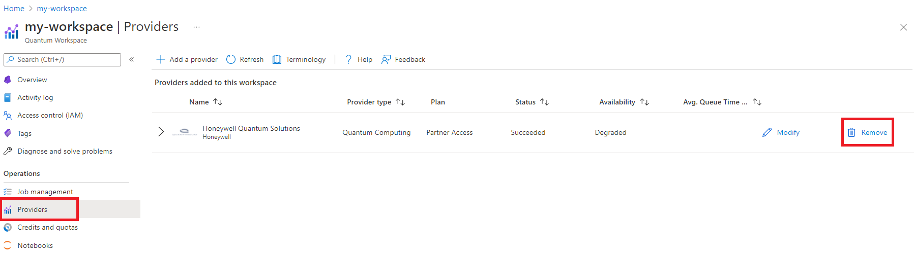

# Honeywell to Quantinuum migration guide

The Honeywell provider has been replaced by the Quantinuum provider in Azure Quantum. This guide is for users who previously used the Honeywell provider and need to migrate to the Quantinuum provider.

> [!Note]
> Existing Honeywell customers who have received Azure Quantum Credits grants will be able to use the Honeywell provider through to the expiration of their grant. For more information, please see your onboarding email for your grant expiry date.

## Step 1: Update your Azure Quantum Workspace

The first step is to open the [Azure portal](https://portal.azure.com) and navigate to your Quantum Workspace. Once you have opened your workspace, follow the steps below:

1. Navigate to the "Providers" pane by clicking the navigation button on the left
2. Locate the Honeywell Provider and click the Delete button. Confirm the deletion by clicking "Yes" in the dialog box that opens.

>   [!div class="mx-imgBorder"]
>   

3. Click the "Add a provider" button on the top of the window
4. Select the Quantinuum provider from the list
5. Select a Billing Plan from Quantinuum. If this is your first time with the Quantinuum provider you are eligible for the $500 free Azure Quantum credit offer with Quantinuum.

Once the deployment completes, you are now ready to use the Quantinuum provider. See below if you have existing code that needs to be migrated to the new provider.

## Step 2: Update existing code to use the Quantinuum Provider

If you have existing code targeting the Honeywell provider, updating to the Quantinuum provider only requires changing the target referenced and updating the version of the Azure Quantum tools you are using.

The table below shows the value to replace in your code to use the equivalent Quantinuum target. Find the target you are using the in `Honeywell Target ID` column, and replace it with the value in the `Quantinuum Target ID` column. You may also just replace the `honeywell` prefix with `quantinuum`.

| Honeywell Target Name | Honeywell Target ID | Quantinuum Target ID |
|-----------------------|---------------------|----------------------|
| Honeywell System Model: H1        | honeywell.hqs-lt-s1        | quantinuum.hqs-lt-s1        |
| Honeywell System Model: H1-2      | honeywell.hqs-lt-s2        | quantinuum.hqs-lt-s2        |
| Honeywell System Model: H1 Family | honeywell.hqs-lt           | quantinuum.hqs-lt           |
| H1 API Validator                  | honeywell.hqs-lt-s1-apival | quantinuum.hqs-lt-s1-apival |
| H1-2 API Validator                | honeywell.hqs-lt-s2-apival | quantinuum.hqs-lt-s2-apival |
| H1 Simulator                      | honeywell.hqs-lt-s1-sim    | quantinuum.hqs-lt-s1-sim    |

### Migrating a Q# Project with Visual Studio Code or Visual Studio
To migrate a Q# project, open the `project.csproj` file in the root folder of your solution, and update the value of `ExecutionTarget` per the table above.

> [!Note]
> If your .csproj file has a fixed SDK version such as `<Project Sdk="Microsoft.Quantum.Sdk/0.17.2105143879">`, ensure you replace the version number with at least `Microsoft.Quantum.Sdk/0.23.195983`.

Old `.csproj` file:
```xml
<Project Sdk="Microsoft.Quantum.Sdk">
  <PropertyGroup>
    <OutputType>Exe</OutputType>
    <TargetFramework>netcoreapp3.1</TargetFramework>
    <ExecutionTarget>honeywell.hqs-lt</ExecutionTarget>
  </PropertyGroup>
</Project>
```

Updated `.csproj` file:
```xml
<Project Sdk="Microsoft.Quantum.Sdk">
  <PropertyGroup>
    <OutputType>Exe</OutputType>
    <TargetFramework>netcoreapp3.1</TargetFramework>
    <ExecutionTarget>quantinuum.hqs-lt</ExecutionTarget>
  </PropertyGroup>
</Project>
```

### Migrating a Q# Project with Jupyter Notebooks
To migrate a Q# project in Jupyter Notebooks, update the value used in the `%azure.target` magic command per the table above.

Old target command:
```py
%azure.target honeywell.hqs-lt-s1-apival
```

Updated target command:
```py
%azure.target quantinuum.hqs-lt-s1-apival
```

You will also need to update your qsharp package by following the instructions in the [Update QDK guide](xref:microsoft.quantum.update-qdk).

### Migrating a Qiskit Project
To migrate a Qiskit project, find the line(s) in your Python file that reference the Honeywell backend, and replace it with the appropriate Quantinuum backend per the table above.

Old backend initialization:
```python
backend = provider.get_backend("honeywell.hqs-lt-s1-apival")
```

Updated backend initialization:
```python
backend = provider.get_backend("quantinuum.hqs-lt-s1-apival")
```

Also, ensure that you have the latest `azure-quantum[qiskit]` package by upgrading with PyPI:
```bash
pip install --upgrade azure-quantum[qiskit]
```

The minimum supported `azure-quantum[qiskit]` version is `0.23.195983`.

### Migrating a Cirq Project
To migrate a Cirq project, find the line(s) in your Python file that reference the Honeywell target, and replace it with the appropriate Quantinuum target per the table above.

Old service initialization:
```python
from azure.quantum.cirq import AzureQuantumService
service = AzureQuantumService(
    resource_id="",
    location="",
    default_target="honeywell.hqs-lt-s1-apival"
)
```

Updated backend initialization:
```python
from azure.quantum.cirq import AzureQuantumService
service = AzureQuantumService(
    resource_id="",
    location="",
    default_target="quantinuum.hqs-lt-s1-apival"
)
```

Also, ensure that you have the latest `azure-quantum[cirq]` package by upgrading with PyPI:
```bash
pip install --upgrade azure-quantum[cirq]
```

The minimum supported `azure-quantum[cirq]` version is `0.23.195983`.

### Migrating a Passthrough Project
To migrate a passthrough project using the `azure-quantum` python package, find the line(s) in your Python file that reference the Honeywell target, and replace it with the appropriate Quantinuum target per the table above.

Old service initialization:
```python
target = workspace.get_targets(name="honeywell.hqs-lt-s1")
```

Updated backend initialization:
```python
target = workspace.get_targets(name="quantinuum.hqs-lt-s1")
```

Also, ensure that you have the latest `azure-quantum` package by upgrading with PyPI:
```bash
pip install --upgrade azure-quantum
```

The minimum supported `azure-quantum` version is `0.23.195983`.
