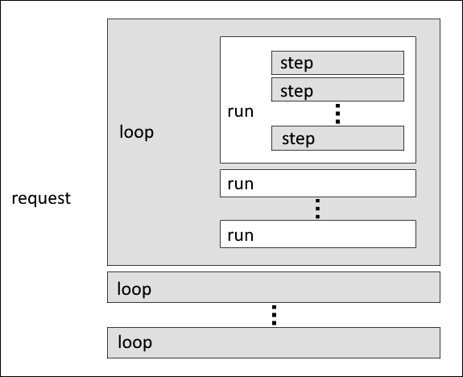

# Toshiba SQBM+ provider

- Publisher: [Toshiba Digital Solutions Corporation](https://www.global.toshiba/jp/company/digitalsolution.html)
- Provider ID: `toshiba`

> [!NOTE]
> Toshiba SQBM+ provider is currently available to customers with their Azure billing accounts in US, UK, Canada and Japan.

## Targets

The Toshiba SQBM+ Cloud on Azure Quantum (SQBM+) provider makes the following target available:

### Ising Solver

This solver enables users to quickly obtain nearly optimal solutions for large-scale combinatorial optimization problems at high speed. It is based on an [Ising model](xref:microsoft.quantum.optimization.concepts.ising-model) machine which can solve combinatorial optimization problems by simulating adiabatic bifurcations in nonlinear Hamiltonian systems.

For more information about the simulated bifurcation machine (SBM), please see [Goto, Tatsumura and Dixon (Science Advances, 5(4), DOI:10.1126/sciadv.aav2372)](https://pubmed.ncbi.nlm.nih.gov/31016238/).

- Job type: `Quantum-Inspired Optimization Problem`
- Data Format: `microsoft.qio.v2`
- Target ID: `toshiba.sbm.ising`
- Python Solver class name: `SimulatedBifurcationMachine`

> [!NOTE]
> The solver uses shared resources to execute the jobs issued by all users. You may experience a delay before the job is executed.

## Overview of SQBM+ computation structure

A computation request to SQBM+ computation service consists of three computation units: step, run, and loop in ascending order:

The smallest unit is a step. A group of steps constitutes a run. A group of runs constitutes a loop. A group of loops constitutes a computation request.

> [!IMPORTANT]
> The number of steps and loops can be specified for each computation request using the computation parameters.
>
> - The *steps* computation parameter specifies the number of steps in a run.
> - The number of *runs* in a loop is predefined for each solver and is fixed at 160.
> - The *loops* computation parameter specifies the number of loops in a request.
>
> For more information, see the [Input Parameters](#input-parameters) section.

The SQBM+ computation service executes a group of runs in parallel, given the initial values of combinatorial variables using random numbers for each run, while each run produces a nearly optimal solution.

This means inside SQBM+ computation service, a computation request produces `number of loops in a request` $\times$ `number of runs in a loop` optimal solutions in total.

The default behavior is that SQBM+ computation service returns the best of these solutions to the user, but it is also possible to return the specified number of solutions in ascending order of evaluation values.
The number of steps and loops affects the accuracy and speed of a computation request.

The auto tuning functionality will help you find a better setting. For detailed parameter settings, refer to [Input Pameters](#input-parameters).

### Input parameters

| Parameter Name | Type | Default | Required | Description |
|--|--|--|--|--|
| `steps` | int | 0 | Optional | Specifies the number of steps in a computation request. The value 0 (zero) means **auto step** where SQBM+ computation service dynamically determines the number of steps. The maximum is 100,000,000. |
| `loops` | int | 1 | Optional | Specifies the number of loops in SQBM+ computation. SQBM+ computation service searches for a better solution while repeating loops as many times as is specified. If 0 (zero) is specified, computation will be repeated until a timeout occurs. The maximum is 10,000,000. |
| `timeout` | float | 10 | Optional | Specifies the maximum computation time (timeout) in seconds. When the computation time reaches the upper limit before completing the computation for $steps \times loops$, the computation ends at that point. In this case, the execution result will be the best solution obtained thus far. If 0 is specified for the parameter loops, loops will be repeated until the time specified by the parameter timeout expires. The maximum is 3600 and the minimum is 0.001. |
| `target` | double | - | Optional | Specifies the end condition of a computation request. When the evaluation value reaches this value, the computation will stop. If 0 is specified for the parameter loops, loops will be repeated either until the objective function reaches the value specified in the parameter target or until a timeout occurs. |
| `maxout` | int | 1 | Optional | Specifies the upper limit of the number of solutions to be outputted. Until the limit specified by maxout is reached, SQBM+ computation service outputs the obtained solutions in ascending order of the value of the objective function. The maximum is 1,000. |
| `dt` | float | 1 | Optional | Specifies the time per step. The range of the value is greater than 0.0 and less than or equal to 1.0. |
| `C` | float | 0 | Optional | Corresponds to the constant ξ0, appearing in the paper by Goto, Tatsumura, & Dixon (2019, p. 2), which is the theoretical basis of SQBM+. Specify the constant as a single-precision floating point number, equal to or more than 0. If the value is 0, the value C is automatically determined. |
| `algo` | string | 2.0 | Optional | Specifies the type of SQBM+ computation algorithm. One of "1.5" or "2.0". Depending on the type of problem, there may be differences in performance between the "1.5" and "2.0" algorithms. Try both and decide which yields better performance. |
| `auto` | bool | false | Optional | Specifies the parameter auto tuning flag. If the value is "true," SQBM+ computation service searches for the values of the parameters automatically to obtain the best solution. Parameters other than `auto` are treated as follows in this case. `algo` and `dt` are ignored and tuned automatically. `loops` and `maxout` are ignored. `timeout` can be specified as the total computation time (sec). Other parameters are treated as defined. |

### Maximum problem size

- Maximum number of spins: 100,000
- Maximum number of non-zero value elements in the problem matrix: 100,000,000

### Completion conditions

SQBM+ computation service is completed when any of the following conditions are satisfied:

- The number of loops reaches `loops` (when `loops` is not 0).
- The computation time reaches `timeout`.
- The value reaches `target` or less (when `target` is specified).

### Output parameters

| Parameter Name | Type | Description |
|--|--|--|
| `runs` | Number | The total number of runs executed, not including interrupted runs. |
| `message` | String | Messages about completion conditions and others.  One of the three message strings (finished, timeout, and reached) is used; their specifications are as follows:<ul><li>"finished": Completed the computation of the specified number of steps and loops.</li><li>"timeout": Stopped the computation because the computation time has reached its timeout.</li><li>"reached": Stopped the computation because the value has reached the value specified in the parameter target.</li><ul> |
| `time` | Number | The calculation time in seconds not including pre-processing and post-processing. If `auto` is "true", the value is the calculation time only when the best solution is obtained. |
| `dt` | Number | The value of the parameter `dt` chosen by the parameter auto tuning. This property is included in the output only if `auto` is "true." |
| `algo` | String | The value of the parameter `algo` chosen by the parameter auto tuning. This property is included in the output only if `auto` is "true." |
| `total_time` | Number | The calculation time in seconds including search time. This property is included in the output only if `auto` is "true." |

## Pricing

To see Toshiba SQBM+ billing plan, visit [Azure Quantum pricing](xref:microsoft.quantum.providers-pricing).
  
## Limits & Quotas
  
Toshiba SQBM+ quotas are tracked based on the number of computing hours within your subscription per month. The computing hours are tracked separately for different plans but otherwise shared at “subscription x region” level. The job concurrency is limited at the workspace level. 
  
Quotas are based on billing plan selection and can be increased with a support ticket. For more information, see [Azure Quantum quotas](xref:microsoft.quantum.providers-quotas).

|Billing plan | Quota  |
|---|---|
|Learn & Develop| Up to 1 concurrent job 1 hour of compute per month |
|Performance at Scale | Up to 3 concurrent jobs 2,500 hours of compute per month |

To see your current limits and quotas, go to the “Credits and quotas” blade and select the “Quotas” tab of your workspace on the [Azure portal](https://portal.azure.com).

