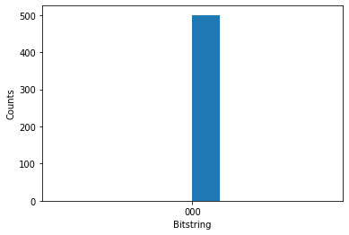

---
author: bradben
description: Learn how to submit specific formatted quantum circuits with QIR, OpenQASM, or Pulser SDK to the Azure Quantum service.
ms.author: brbenefield
ms.date: 03/01/2024
ms.service: azure-quantum
ms.subservice: qdk
ms.topic: how-to
no-loc: ['Python', '$$v', target, targets]
title: Submit formatted quantum circuits
uid: microsoft.quantum.quickstarts.computing.provider
#customer intent: As quantum developer, I want to learn how to submit QIR, OpenQASM, or Pulser SDK to the Azure Quantum service.
--- 

# How to submit specific formatted circuits to Azure Quantum

Learn how to use the `azure-quantum` Python package to submit circuits in specific formats to the Azure Quantum service. This article shows you how to submit circuits in the following formats:

- [Submit QIR circuits](#submit-qir-formatted-circuits)
- [Submit provider-specific circuits](#submit-a-circuit-with-a-provider-specific-format-to-azure-quantum)

For more information, see [Quantum circuits](xref:microsoft.quantum.concepts.circuits).

[!INCLUDE [Classic QDK banner](includes/classic-qdk-deprecation.md)]

## Prerequisites

To run your circuits in a Notebook in Azure portal, you need:

- An Azure account with an active subscription. If you don’t have an Azure account, register for free and sign up for a [pay-as-you-go subscription](https://azure.microsoft.com/pricing/purchase-options/pay-as-you-go).
- An Azure Quantum workspace. For more information, see [Create an Azure Quantum workspace](xref:microsoft.quantum.how-to.workspace).

To develop and run your circuits in Visual Studio Code, you also need:

- A Python environment with [Python and Pip](https://apps.microsoft.com/detail/9NRWMJP3717K) installed.
- VS Code with the [Azure Quantum Development Kit](https://marketplace.visualstudio.com/items?itemName=quantum.qsharp-lang-vscode), [Python](https://marketplace.visualstudio.com/items?itemName=ms-python.python), and [Jupyter](https://marketplace.visualstudio.com/items?itemName=ms-toolsai.jupyter) extensions installed.
- The Azure Quantum `qsharp`, `azure-quantum`, and `ipykernel` packages.  

    ```bash
    python -m pip install --upgrade qsharp azure-quantum ipykernel
    ```

## Create a new Jupyter Notebook

You can create a notebook in VS Code or directly in the Azure Quantum portal. 

### [Azure Quantum portal](#tab/tabid-portal)

1. Log in to the [Azure portal](https://portal.azure.com/) and select the workspace from the previous step.
1. In the left blade, select **Notebooks**.
1. Click **My Notebooks** and click **Add New**.
1. In **Kernel Type**, select **IPython**.
1. Type a name for the file, and click **Create file**. 

When your new Notebook opens, it automatically creates the code for the first cell, based on your subscription and workspace information.

```python
from azure.quantum import Workspace
workspace = Workspace ( 
    resource_id = "", # Your resource_id 
    location = ""  # Your workspace location (for example, "westus") 
)
```

### [Visual Studio Code](#tab/tabid-vscode)

1. In VS Code, select **View > Command palette** and select **Create: New Jupyter Notebook**.
1. To connect to the Azure Quantum service, your program will need the resource ID and the
location of your Azure Quantum workspace. Log in to your Azure account,
<https://portal.azure.com>, navigate to your Azure Quantum workspace, and
copy the values from the header.

    

1. In the first cell of your notebook, paste the values into the following `Workspace` constructor to
create a `workspace` object that connects to your Azure Quantum workspace.

    ```python
    from azure.quantum import Workspace
    workspace = Workspace ( 
        resource_id = "", # Add your resource_id 
        location = ""  # Add your workspace location (for example, "westus") 
    )
    ```

***

## Submit QIR-formatted circuits

Quantum Intermediate Representation (QIR) is an intermediate representation which serves as a common interface between quantum programming languages/frameworks and targeted quantum computation platforms. For more information, see [Quantum Intermediate Representation](xref:microsoft.quantum.concepts.qir).

1. Create the QIR circuit. For example, the following code creates a simple entanglement circuit.

    ```python
    QIR_routine = """%Result = type opaque
    %Qubit = type opaque
    
    define void @ENTRYPOINT__main() #0 {
      call void @__quantum__qis__h__body(%Qubit* inttoptr (i64 0 to %Qubit*))
      call void @__quantum__qis__cx__body(%Qubit* inttoptr (i64 0 to %Qubit*), %Qubit* inttoptr (i64 1 to %Qubit*))
      call void @__quantum__qis__h__body(%Qubit* inttoptr (i64 2 to %Qubit*))
      call void @__quantum__qis__cz__body(%Qubit* inttoptr (i64 2 to %Qubit*), %Qubit* inttoptr (i64 0 to %Qubit*))
      call void @__quantum__qis__h__body(%Qubit* inttoptr (i64 2 to %Qubit*))
      call void @__quantum__qis__h__body(%Qubit* inttoptr (i64 3 to %Qubit*))
      call void @__quantum__qis__cz__body(%Qubit* inttoptr (i64 3 to %Qubit*), %Qubit* inttoptr (i64 1 to %Qubit*))
      call void @__quantum__qis__h__body(%Qubit* inttoptr (i64 3 to %Qubit*))
      call void @__quantum__qis__mz__body(%Qubit* inttoptr (i64 2 to %Qubit*), %Result* inttoptr (i64 0 to %Result*)) #1
      call void @__quantum__qis__mz__body(%Qubit* inttoptr (i64 3 to %Qubit*), %Result* inttoptr (i64 1 to %Result*)) #1
      call void @__quantum__rt__tuple_record_output(i64 2, i8* null)
      call void @__quantum__rt__result_record_output(%Result* inttoptr (i64 0 to %Result*), i8* null)
      call void @__quantum__rt__result_record_output(%Result* inttoptr (i64 1 to %Result*), i8* null)
      ret void
    }
    
    declare void @__quantum__qis__ccx__body(%Qubit*, %Qubit*, %Qubit*)
    declare void @__quantum__qis__cx__body(%Qubit*, %Qubit*)
    declare void @__quantum__qis__cy__body(%Qubit*, %Qubit*)
    declare void @__quantum__qis__cz__body(%Qubit*, %Qubit*)
    declare void @__quantum__qis__rx__body(double, %Qubit*)
    declare void @__quantum__qis__rxx__body(double, %Qubit*, %Qubit*)
    declare void @__quantum__qis__ry__body(double, %Qubit*)
    declare void @__quantum__qis__ryy__body(double, %Qubit*, %Qubit*)
    declare void @__quantum__qis__rz__body(double, %Qubit*)
    declare void @__quantum__qis__rzz__body(double, %Qubit*, %Qubit*)
    declare void @__quantum__qis__h__body(%Qubit*)
    declare void @__quantum__qis__s__body(%Qubit*)
    declare void @__quantum__qis__s__adj(%Qubit*)
    declare void @__quantum__qis__t__body(%Qubit*)
    declare void @__quantum__qis__t__adj(%Qubit*)
    declare void @__quantum__qis__x__body(%Qubit*)
    declare void @__quantum__qis__y__body(%Qubit*)
    declare void @__quantum__qis__z__body(%Qubit*)
    declare void @__quantum__qis__swap__body(%Qubit*, %Qubit*)
    declare void @__quantum__qis__mz__body(%Qubit*, %Result* writeonly) #1
    declare void @__quantum__rt__result_record_output(%Result*, i8*)
    declare void @__quantum__rt__array_record_output(i64, i8*)
    declare void @__quantum__rt__tuple_record_output(i64, i8*)
    
    attributes #0 = { "entry_point" "output_labeling_schema" "qir_profiles"="base_profile" "required_num_qubits"="4" "required_num_results"="2" }
    attributes #1 = { "irreversible" }
    
    ; module flags
    
    !llvm.module.flags = !{!0, !1, !2, !3}
    
    !0 = !{i32 1, !"qir_major_version", i32 1}
    !1 = !{i32 7, !"qir_minor_version", i32 0}
    !2 = !{i32 1, !"dynamic_qubit_management", i1 false}
    !3 = !{i32 1, !"dynamic_result_management", i1 false}
    """
    ```

1. Create a `submit_qir_job` helper function to submit the QIR circuit to a target. Note that the input and output data formats are specified as `qir.v1` and `microsoft.quantum-results.v1`, respectively.

    ```python 
    # Submit the job with proper input and output data formats
    def submit_qir_job(target, input, name, count=100):
        job = target.submit(
            input_data=input, 
            input_data_format="qir.v1",
            output_data_format="microsoft.quantum-results.v1",
            name=name,
            input_params = {
                "entryPoint": "ENTRYPOINT__main",
                "arguments": [],
                "count": count
                }
        )
    
        print(f"Queued job: {job.id}")
        job.wait_until_completed()
        print(f"Job completed with state: {job.details.status}")
        #if job.details.status == "Succeeded":
        result = job.get_results()
    
        return result
    ```

1. Select a target and submit the QIR circuit to Azure Quantum. For example, to submit the QIR circuit to the IonQ simulator target:

    ```python
    target = workspace.get_targets(name="ionq.simulator") 
    result = submit_qir_job(target, QIR_routine, "QIR routine")
    result
    ```

    ```output
    {'Histogram': ['(0, 0)', 0.5, '(1, 1)', 0.5]}
    ```

## Submit a circuit with a provider-specific format to Azure Quantum

Besides QIR languages, such as Q# or Qiskit, you can submit quantum circuits in provider-specific formats to Azure Quantum. Each provider has its own format for representing quantum circuits.

- [IonQ](#submit-a-circuit-to-ionq-using-json-format)
- [PASQAL](#submit-a-circuit-to-pasqal-using-pulser-sdk)
- [Quantinuum](#submit-a-circuit-to-quantinuum-using-openqasm)
- [Rigetti](#submit-a-circuit-to-rigetti-using-quil)

### Submit a circuit to IonQ using JSON format

1. Create a quantum circuit using the the language-agnostic JSON format supported by the [IonQ targets](xref:microsoft.quantum.providers.ionq), as described in the [IonQ API documentation](https://docs.ionq.com/#tag/quantum_programs). For example, the following sample creates a superposition between three qubits:

    ```python
    circuit = {
        "qubits": 3,
        "circuit": [
            {
            "gate": "h",
            "target": 0
            },
            {
            "gate": "cnot",
            "control": 0,
            "target": 1
            },
            {
            "gate": "cnot",
            "control": 0,
            "target": 2
            },
        ]
    }
    ```

1. Submit the circuit to the IonQ target. The following example uses the IonQ simulator, which returns a `Job` object.

    ```python
    target = workspace.get_targets(name="ionq.simulator")
    job = target.submit(circuit)
    ```

1. Wait until the job is complete and then fetch the results.

    ```python
    results = job.get_results()
    print(results)
    ```

    ```output
    .....
    {'duration': 8240356, 'histogram': {'0': 0.5, '7': 0.5}}
    ```

1. You can then visualize the results using [Matplotlib](https://matplotlib.org/stable/users/installing/index.html).

    ```python
    import pylab as pl
    pl.rcParams["font.size"] = 16
    hist = {format(n, "03b"): 0 for n in range(8)}
    hist.update({format(int(k), "03b"): v for k, v in results["histogram"].items()})
    pl.bar(hist.keys(), hist.values())
    pl.ylabel("Probabilities")
    ```

    

1. Before running a job on the QPU, you can estimate how much it will cost to run. To estimate the cost of running a job on the QPU,you can use the `estimate_cost` method:

    ```python
    target = workspace.get_targets(name="ionq.qpu")
    cost = target.estimate_cost(circuit, shots=500)
    
    print(f"Estimated cost: {cost.estimated_total}")
    ```

    This prints the estimated cost in USD.

    > [!NOTE]
    > For the most current pricing details, see [IonQ Pricing](xref:microsoft.quantum.providers.ionq#pricing), or find your workspace and view pricing options in the "Provider" tab of your workspace via: [aka.ms/aq/myworkspaces](https://aka.ms/aq/myworkspaces).

### Submit a circuit to PASQAL using Pulser SDK

To submit a circuit to PASQAL, you can use the Pulser SDK to create pulse sequences and submit them to the PASQAL target.

#### Install the Pulser SDK 

[Pulser](https://github.com/pasqal-io/Pulser) is a framework for composing, simulating and executing pulse sequences for neutral-atom quantum devices. It's designed by PASQAL as a pass-through to submit quantum experiments to their quantum processors. For more information, see [Pulser documentation](https://pulser.readthedocs.io/en/latest/).

To submit the pulse sequences, first install the Pulser SDK packages:

```python
try:
    import pulser
except ImportError:
    !pip -q install pulser
    !pip -q install pulser-core
```

#### Create a quantum register

1. First, load the required imports:

    ```python
    import numpy as np
    import pulser
    from pprint import pprint
    from pulser import Pulse, Sequence, Register
    ```

1. PASQAL's QPU is made of neutral atoms trapped at well-defined positions in a lattice. To define your quantum registers you create an array of qubits on a lattice. For example, the following code creates a 4x4 square lattice of qubits:

    ```python
    L = 4
    square = np.array([[i, j] for i in range(L) for j in range(L)], dtype=float)
    square -= np.mean(square, axis=0)
    square *= 5
    
    qubits = dict(enumerate(square))
    reg = Register(qubits)
    reg.draw()
    ```

    :::image type="content" source="media/provider-format-pasqal-array.png" alt-text="Plot of a 4x4 square lattice with 16 qubits.":::

#### Write a pulse sequence

The neutral atoms are controlled with laser pulses. The Pulser SDK allows you to create pulse sequences to apply to the quantum register.

1. First, you need to set up a pulse sequence, and declare the channels that will be used to control the atoms. For example, the following code declares two channels: `ch0` and `ch1`.

    ```python
    from pulser.devices import Chadoq2
    
    seq = Sequence(reg, Chadoq2)
    
    seq.declare_channel("ch0", "raman_local")
    print("Available channels after declaring 'ch0':")
    pprint(seq.available_channels)
    
    seq.declare_channel("ch1", "rydberg_local", initial_target=4)
    print("\nAvailable channels after declaring 'ch1':")
    pprint(seq.available_channels)
    ```

    A few things to consider:
    - A `Sequence` in Pulser is a series of operations that are to be executed on a quantum register.
    - The code sets up a sequence of operations to be executed on a `AnalogDevice` device. `AnalogDevice` is a predefined device in Pulser that represents a Fresnel1-equivalent quantum computer.

1. Create a pulse sequence. To do so, you create and add pulses to the channels you declared. For example, the following code creates a simple pulse and adds it to channel `ch0`, and then creates a complex pulse and adds it to channel `ch1`.

    ```python
    seq.target(1, "ch0") # Target qubit 1 with channel "ch0"
    simple_pulse = Pulse.ConstantPulse(200, 2, -10, 0)
    seq.add(simple_pulse, "ch0") # Add the pulse to channel "ch0"
    seq.delay(100, "ch1")
    from pulser.waveforms import RampWaveform, BlackmanWaveform
    
    duration = 1000
    # Create a Blackman waveform with a duration of 1000 ns and an area of pi/2 rad
    amp_wf = BlackmanWaveform(duration, np.pi / 2)  
    # Create a ramp waveform with a duration of 1000 ns and a linear sweep from -20 to 20 rad/µs
    detuning_wf = RampWaveform(duration, -20, 20) 

    # Create a pulse with the amplitude waveform amp_wf, the detuning waveform detuning_wf, and a phase of 0 rad.
    complex_pulse = Pulse(amp_wf, detuning_wf, phase=0) 
    complex_pulse.draw()
    seq.add(complex_pulse, "ch1") # Add the pulse to channel "ch1"
    ```

The image shows the simple and the complex pulse.

:::image type="content" source="media/provider-format-pasqal-pulser.png" alt-text="Plot of the simple and the complex pulse.":::

#### Convert the sequence to a JSON string

To submit the pulse sequences, you need to convert the Pulser objects into a JSON string that can be used as input data.

```python
import json

# Convert the sequence to a JSON string
def prepare_input_data(seq):
    input_data = {}
    input_data["sequence_builder"] = json.loads(seq.to_abstract_repr())
    to_send = json.dumps(input_data)
    #print(json.dumps(input_data, indent=4, sort_keys=True))
    return to_send
```

#### Submit the pulse sequence to PASQAL target

1. First, you need to set the proper input and output data formats. For example, the following code sets the input data format to `pasqal.pulser.v1` and the output data format to `pasqal.pulser-results.v1`.

    ```python
    # Submit the job with proper input and output data formats
    def submit_job(target, seq):
        job = target.submit(
            input_data=prepare_input_data(seq), # Take the JSON string previously defined as input data
            input_data_format="pasqal.pulser.v1", 
            output_data_format="pasqal.pulser-results.v1",
            name="PASQAL sequence",
            shots=100 # Number of shots
        )
    
        print(f"Queued job: {job.id}")
        job.wait_until_completed()
        print(f"Job completed with state: {job.details.status}")
        result = job.get_results()
    
        return result
    ```

    > [!NOTE]
    > The time required to run a circuit on the QPU depends on current queue times. You can view the average queue time for a target by selecting the **Providers** blade of your workspace.

1. Submit the program to PASQAL. For example, you can submit the program to [PASQAL Emu-TN target](xref:microsoft.quantum.providers.pasqal#emu-tn).

    ```python
    target = workspace.get_targets(name="pasqal.sim.emu-tn")
    submit_job(target, seq)
    ```

    ```ouput
    {'0000000000000000': 59,
     '0000100000000000': 39,
     '0100000000000000': 1,
     '0100100000000000': 1}
    ```

### Submit a circuit to Quantinuum using OpenQASM

1. Create a quantum circuit in the [OpenQASM](https://en.wikipedia.org/wiki/OpenQASM) representation. For example, the following example creates a Teleportation circuit:

    ```py
    circuit = """OPENQASM 2.0;
    include "qelib1.inc";
    qreg q[3];
    creg c0[3];
    h q[0];
    cx q[0], q[1];
    cx q[1], q[2];
    measure q[0] -> c0[0];
    measure q[1] -> c0[1];
    measure q[2] -> c0[2];
    """
    ```

    Optionally, you can load the circuit from a file:

    ```py
    with open("my_teleport.qasm", "r") as f:
        circuit = f.read()
    ```

1. Submit the circuit to the Quantinuum target. The following example uses the Quantinuum API validator, which returns a `Job` object. 

    ```python
    target = workspace.get_targets(name="quantinuum.sim.h1-1sc")
    job = target.submit(circuit, shots=500)
    ```

1. Wait until the job is complete and then fetch the results.

    ```python
    results = job.get_results()
    print(results)
    ```

    ```output
    ........
    {'c0': ['000',
    '000',
    '000',
    '000',
    '000',
    '000',
    '000',
    ...
    ]}
    ```

1. You can then visualize the results using [Matplotlib](https://matplotlib.org/stable/users/installing/index.html).

    ```python
    import pylab as pl
    pl.hist(results["c0"])
    pl.ylabel("Counts")
    pl.xlabel("Bitstring")
    ```

    

    Looking at the histogram, you may notice that the random number generator returned 0 every time, which is not very random. This is because that, while the API Validator ensures that your code will run successfully on Quantinuum hardware, it also returns 0 for every quantum measurement. For a true random number generator, you need to run your circuit on quantum hardware.

1. Before running a job on the QPU, you can estimate how much it will cost to run. To estimate the cost of running a job on the QPU, you can use the `estimate_cost` method.

    ```python
    target = workspace.get_targets(name="quantinuum.qpu.h1-1")
    cost = target.estimate_cost(circuit, shots=500)
    
    print(f"Estimated cost: {cost.estimated_total}")
    ```

    This prints the estimated cost in H-System Quantum Credits (HQCs).

    > [!NOTE]
    > To run a cost estimate against a Quantinuum target, you must first reload the *azure-quantum* Python package with the *\[qiskit\]* parameter, and ensure that you have the latest version of Qiskit. For more information, see [Update the azure-quantum Python package](xref:microsoft.quantum.update-qdk#update-the-azure-quantum-python-packages).

    > [!NOTE]
    > For the most current pricing details, see [Azure Quantum pricing](xref:microsoft.quantum.providers-pricing#quantinuum), or find your workspace and view pricing options in the "Provider" tab of your workspace via: [aka.ms/aq/myworkspaces](https://aka.ms/aq/myworkspaces).
    
### Submit a circuit to Rigetti using Quil

The easiest way to submit Quil jobs is using the [pyquil-for-azure-quantum](https://pypi.org/project/pyquil-for-azure-quantum/) package, as it allows you to use the tools and documentation of the [pyQuil](https://pyquil-docs.rigetti.com/en/stable/) library. Without this package, pyQuil can be used to _construct_ Quil programs but not to submit them to Azure Quantum.

You can also construct Quil programs manually and submit them using the `azure-quantum` package directly.

### [Use pyquil-for-azure-quantum](#tab/tabid-pyquil)

1. First, load the required imports.

    ```python
    from pyquil.gates import CNOT, MEASURE, H
    from pyquil.quil import Program
    from pyquil.quilbase import Declare
    from pyquil_for_azure_quantum import get_qpu, get_qvm
    ```

1. Use the `get_qvm` or `get_qpu` function to get a connection to the QVM or QPU.

    ```python
    qc = get_qvm()  # For simulation
    # qc = get_qpu("Ankaa-2") for submitting to a QPU
    ```

1. Create a Quil program. Any valid Quil program is accepted, but the readout **must** be named `ro`.

    ```python
    program = Program(
        Declare("ro", "BIT", 2),
        H(0),
        CNOT(0, 1),
        MEASURE(0, ("ro", 0)),
        MEASURE(1, ("ro", 1)),
    ).wrap_in_numshots_loop(5)
    
    # Optionally pass to_native_gates=False to .compile() to skip the compilation stage
    
    result = qc.run(qc.compile(program))
    data_per_shot = result.readout_data["ro"]
    ```

1. Here, `data_per_shot` is a `numpy` array, so you can use `numpy` methods.

    ```python
    assert data_per_shot.shape == (5, 2)
    ro_data_first_shot = data_per_shot[0]
    assert ro_data_first_shot[0] == 1 or ro_data_first_shot[0] == 0
    ```

1. Print out all the data.

    ```python
    print("Data from 'ro' register:")
    for i, shot in enumerate(data_per_shot):
        print(f"Shot {i}: {shot}")
    ```

### [Use azure-quantum Python SDK](#tab/tabid-azquantum) 

1. First, load the required imports.

    ```python
    from azure.quantum import Workspace
    from azure.quantum.target.rigetti import Result, Rigetti, RigettiTarget, InputParams
    ```

1. Create a `target` object and select the name of the Rigetti's target. For example, the following code selects the `Ankaa-2` target. 

    ```python
    target = Rigetti(
        workspace=workspace,
        name=RigettiTarget.ANKAA_2,  # Defaults to RigettiTarget.QVM for simulation
    )
    ```

1. Create a Quil program. Any valid Quil program is accepted, but the readout **must** be named `ro`.

    ```python
    readout = "ro"
    bell_state_quil = f"""
    DECLARE {readout} BIT[2]
    
    H 0
    CNOT 0 1
    
    MEASURE 0 {readout}[0]
    MEASURE 1 {readout}[1]
    """
    
    num_shots = 5
    job = target.submit(
        input_data=bell_state_quil, 
        name="bell state", 
        shots=100, 
        input_params=InputParams(skip_quilc=False)
    )

    print(f"Job completed with state: {job.details.status}")
    result = Result(job)  # This throws an exception if the job failed
    ```

1. You can index a Result with the name of the readout. In this case, `ro`. Here, `data_per_shot` is a list of length num_shots, each entry is a list containing the data for the register for that shot.

    ```python
    data_per_shot = result[readout]
    
    ro_data_first_shot = data_per_shot[0]
    ```

    In this case, because the type of the register is BIT, the type will be integer and the value either 0 or 1.

    ```python
    assert isinstance(ro_data_first_shot[0], int)
    assert ro_data_first_shot[0] == 1 or ro_data_first_shot[0] == 0
    ```

1. Print out all the data

    ```python
    print(f"Data from '{readout}' register:")
    for i, shot in enumerate(data_per_shot):
        print(f"Shot {i}: {shot}")
    ```

***

> [!IMPORTANT]
> Submitting multiple circuits on a single job is currently not supported. As a workaround you can call the `backend.run` method to submit each circuit asynchronously, then fetch the results of each job. For example:
>
> ```python
> jobs = []
> for circuit in circuits:
>     jobs.append(backend.run(circuit, shots=N))
> 
> results = []
> for job in jobs:
>     results.append(job.result())
>```

## Related content

- [Submit a circuit with Qiskit to Azure Quantum](xref:microsoft.quantum.quickstarts.computing.qiskit).
- [Submit a circuit with Cirq to Azure Quantum](xref:microsoft.quantum.quickstarts.computing.cirq).