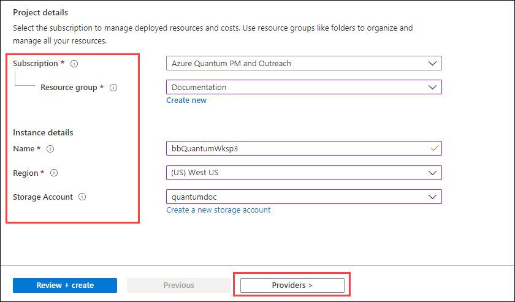
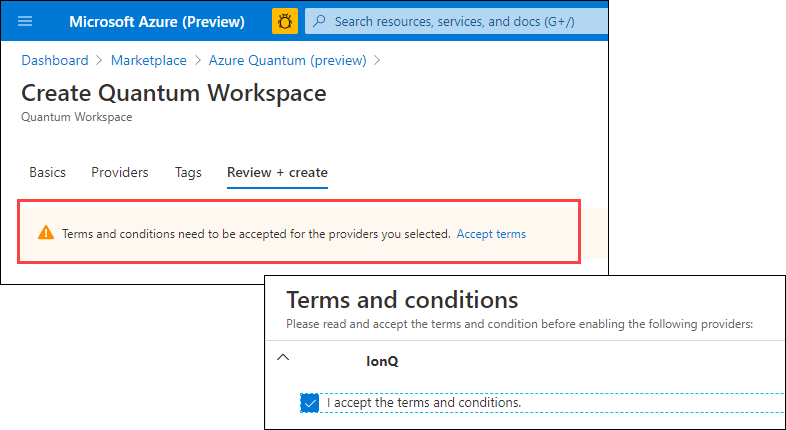

# Optimization quickstart for Azure Quantum

Learn how to use Azure Quantum to solve a simple binary optimization problem.

## Prerequisites

- To complete this tutorial you need an Azure subscription. If you don't have
  an Azure subscription, create a [free account](https://azure.microsoft.com/free/) before you begin.

## Create an Azure Quantum workspace

You use the Azure Quantum service by adding a **Quantum Workspace** resource to your Azure subscription in the Azure portal. An Azure Quantum workspace resource, or workspace for short, is a collection of assets associated with running quantum or optimization applications.

To open the Azure Portal, go to https://portal.azure.com and then follow these steps:

> Note: This is a special link that allows you to create a workspace in the Azure Portal. Without using the link you will be able to see existing workspaces but not create new ones.

1. Click **Create a resource** and then search for **Azure Quantum**. On the results page, you should see a tile for the **Azure Quantum (preview)** service.

   

1. Click **Azure Quantum (preview)** and then click  **Create**. This opens a form to create a workspace.

   

1. Fill out the details of your workspace:
   - **Subscription:** The subscription that you want to associate with this
     workspace. 
   - **Resource group:** The resource group that you want to assign this workspace to.
   - **Name:** The name of your workspace.
   - **Region:** The region for the workspace.
   - **Storage Account**: The Azure storage account to store your jobs and results. If you don't have an existing storage account, click **Create a new storage account** and complete the necessary fields. For this preview, we recommend using the default values.

   


   > [!NOTE]
   > You must be an Owner of the selected resource group to create a new storage account. For more information about how resource groups work in Azure, see [Control and organize Azure resources with Azure Resource Manager](https://docs.microsoft.com/learn/modules/control-and-organize-with-azure-resource-manager/).

1. After completing the information, click the **Providers** tab to add providers to your workspace. A provider gives you access to a quantum service, which can be quantum hardware, a quantum simulator, or an optimization service.

1. Ensure the Microsoft QIO provider is enabled (it is by default), then click **Review + create**.

1. Review the setting you've selected and if everything is correct, click on **Create** to create your workspace.

   

> [!NOTE] 
> While we are not charging for usage of Azure Quantum during this
> preview, your jobs will be uploaded to the Azure storage account created above and will be subject to storage charges.

## Define your optimization problem

In this guide, you will solve a simple optimization example to get started with the optimization services of Azure Quantum. This quickstart is based on the [ship loading sample](https://github.com/microsoftdocs/quantum-docs-private/blob/feature/onboarding-azure-quantum/azure-quantum/samples/shipping-sample/). 

Suppose there are two ships ready to be loaded with containers and a list of containers of varying weights to be assigned to each ship. The aim of the optimization problem is to assign containers to each ship in such a way that the weight is distributed as evenly as possible between both ships.

The cost function for this optimization problem looks like the following:

$$ H^{2} = \Large(\sum_{i \in A \cup B} w_{i} x_{i})^{2} $$

This cost function has the following properties:

- If all the containers are on one ship, the function is at its highest value - reflecting that this is the least optimal solution
- If the containers are perfectly balanced, the value of the summation inside the square is ${0}$ - the function is at its lowest value. This solution is optimal.

The goal is to find the configuration that yields the lowest possible value of $H^2$.

> [!NOTE]
> For a detailed walkthrough of the problem scenario and how the cost function is constructed, please refer to the [sample](https://github.com/microsoftdocs/quantum-docs-private/blob/feature/onboarding-azure-quantum/azure-quantum/samples/shipping-sample/) and/or the associated [Microsoft Learn module](https://docs.microsoft.com/learn/modules/solve-quantum-inspired-optimization-problems/).

## Install the Python SDK for optimization

To implement a solution, first ensure that you have the Python SDK for optimization installed on your machine. If you haven't
installed the Python SDK for optimization already, follow these steps:

1. Install [Python](https://www.python.org/downloads/) 3.6 or later in case you haven't already.
1. Install [PIP](https://pip.pypa.io/en/stable/) and ensure you have **version 19.2 or higher**.
1. Install the `azure-quantum` python package.

   ```bash
   pip install --upgrade azure-quantum --pre
   ```

## Create a `Workspace` object in your Python code and log in

Now create a Python file or Jupyter Notebook, import the `Workspace` module from `azure.quantum`, and create a `Workspace` object. This is what you will use to submit our optimization problem to Azure Quantum. The value for `resource_id` can be found on the Azure Portal page for the [workspace you created](xref:microsoft.quantum.workspaces-portal).

Once the `Workspace` object is created, you log in using the `workspace.login()` command.

```python
from azure.quantum import Workspace

# Copy the settings for your workspace below
workspace = Workspace(
    resource_id = "", # add the Resource ID of the Azure Quantum workspace you created
    location    = ""  # add the Azure region in which the Azure Quantum workspace was created (optional, defaults to "West US")
)
workspace.login()
```

The first time you run this code on your device, a window might prompt in your default browser asking for your credentials.

## Generate the terms for the problem

Next, you need to transform the mathematical representation of the problem
into code. As a reminder, this is what the cost function looks like:

$$ H^{2} = \Large(\sum_{i \in A \cup B} w_{i} x_{i})^{2} $$

Below, you can see the code required to generate the terms (`Term`) of the cost function:

```python
from typing import List
from azure.quantum.optimization import Problem, ProblemType, Term

def createProblemForContainerWeights(containerWeights: List[int]) -> List[Term]:

    terms: List[Term] = []

    # Expand the squared summation
    for i in range(len(containerWeights)):
        for j in range(len(containerWeights)):
            if i == j:
                # Skip the terms where i == j as they can be disregarded:
                # w_i∗w_j∗x_i∗x_j = w_i​*w_j∗(x_i)^2 = w_i∗w_j​​
                # for x_i = x_j, x_i ∈ {1, -1}
                continue

            terms.append(
                Term(
                    w = containerWeights[i] * containerWeights[j],
                    indices = [i, j]
                )
            )

    return terms
```

> [!NOTE]
> For a detailed explanation of how this function is derived, please refer to the [shipping sample](https://github.com/microsoftdocs/quantum-docs-private/blob/feature/onboarding-azure-quantum/azure-quantum/samples/shipping-sample/) or the [Microsoft Learn module for optimization](https://docs.microsoft.com/learn/modules/solve-quantum-inspired-optimization-problems/).

## Create a `Problem` instance

Now that you have a way to generate the terms for the problem, let's provide a specific example and build out the cost function:

```python
# This array contains a list of the weights of the containers:
containerWeights = [1, 5, 9, 21, 35, 5, 3, 5, 10, 11]

# Create the Terms for this list of containers:
terms = createProblemForContainerWeights(containerWeights)
```

The next step is to create an instance of a `Problem` to submit to the Azure Quantum solver:

```python
# Create the Problem to submit to the solver:
problem = Problem(name="Ship Loading Problem", problem_type=ProblemType.ising, terms=terms)
```

Above, you can see that you have provided the following parameters:

- `name`: The name of the problem, used to identify the job in the Azure portal later on
- `problem_type`: In this instance, you have chosen an `ising` representation for the problem due to the way we defined the cost function, however you could alternatively have chosen a `pubo` representation.
- `terms`: These are the terms defining the cost function that you generated previously.

## Submit your problem to Azure Quantum

Next, you will submit the `Problem` instance defined to Azure Quantum.

```python
from azure.quantum.optimization import ParallelTempering

# Instantiate a solver instance to solve the problem
solver = ParallelTempering(workspace, timeout=100) # timeout in seconds

# Optimize the problem
result = solver.optimize(problem)
```

Here you created an instance of a `ParallelTempering` solver for the problem. You could have chosen other Azure Quantum optimization solvers (e.g. `SimulatedAnnealing`) without needing to change more lines of code. The type `Problem` is the common parameter for all the solvers of Azure Quantum.

You then call `solver.optimize()` and supply the `problem` as the argument. This submits the problem synchronously to Azure Quantum and returns a Python dictionary of values to save the `result` variable for parsing in the next step.

> [!NOTE]
> You can also submit problems asynchronously. For more info, you can go to the guide for [advanced usage of the Python SDK for optimization](xref:microsoft.quantum.optimization.python-sdk.advanced#asynchronous-problem-solving).

## Results readout

The final step is to transform the result returned by calling `solver.optimize()` to something human-readable. The following code takes the configuration `dict` returned by the service and prints out a list of container assignments:

```python
def printResultSummary(result):
    # Print a summary of the result
    shipAWeight = 0
    shipBWeight = 0
    for container in result['configuration']:
        containerAssignment = result['configuration'][container]
        containerWeight = containerWeights[int(container)]
        ship = ''
        if containerAssignment == 1:
            ship = 'A'
            shipAWeight += containerWeight
        else:
            ship = 'B'
            shipBWeight += containerWeight

        print(f'Container {container} with weight {containerWeight} was placed on Ship {ship}')

    print(f'\nTotal weights: \n\tShip A: {shipAWeight} tonnes \n\tShip B: {shipBWeight} tonnes')

printResultSummary(result)
```

The output should look something like this:

```bash
Container 0 with weight 1 was placed on Ship A
Container 1 with weight 5 was placed on Ship B
Container 2 with weight 9 was placed on Ship A
Container 3 with weight 21 was placed on Ship A
Container 4 with weight 35 was placed on Ship B
Container 5 with weight 5 was placed on Ship B
Container 6 with weight 3 was placed on Ship B
Container 7 with weight 5 was placed on Ship B
Container 8 with weight 10 was placed on Ship A
Container 9 with weight 11 was placed on Ship A

Total weights:
    Ship A: 52 tonnes
    Ship B: 53 tonnes
```

## Next steps

During this quick-start guide, you have seen an end-to-end example of how to take a mathematical cost function, represent it in code, submit it to Azure Quantum and parse the results.

For more detailed information on the shipping optimization problem, please refer to the following resources:

- [Ship loading sample](https://github.com/microsoftdocs/quantum-docs-private/blob/feature/onboarding-azure-quantum/azure-quantum/samples/shipping-sample/README.md)
- [Microsoft Learn module](https://docs.microsoft.com/learn/modules/solve-quantum-inspired-optimization-problems/)

Once you have explored the ship loading sample in more detail, you may find it useful to tackle the more complex [job shop scheduling sample](https://github.com/microsoftdocs/quantum-docs-private/blob/feature/onboarding-azure-quantum/azure-quantum/samples/job-shop-sample/).
