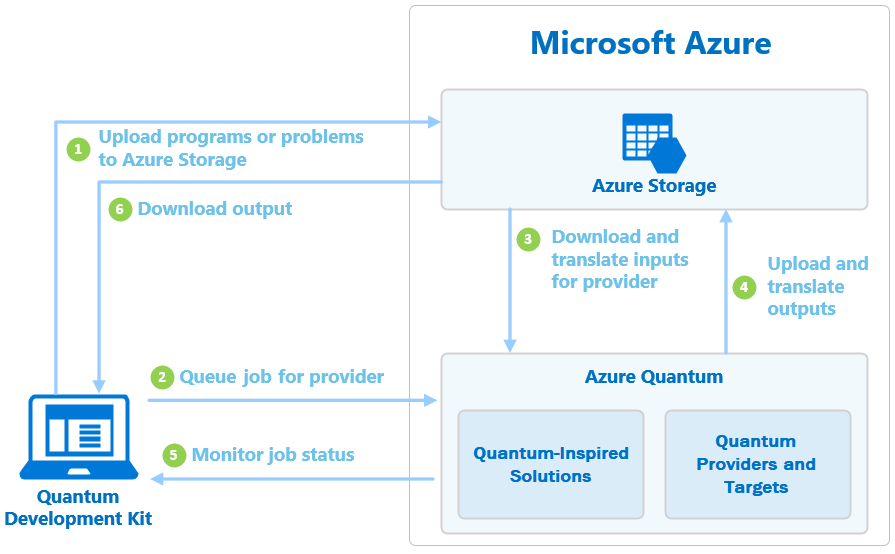

# Introduction to Azure Quantum

Azure Quantum is a Microsoft Azure service that you can use to run quantum computing programs or solve [optimization](#optimization) problems in the cloud. Using the Azure Quantum tools and SDKs, you can create quantum programs and run them against different quantum simulators and machines.

> [!NOTE]
> In this limited preview, not all providers are available to all users.

## Optimization

Azure Quantum gives you access to a broad set of state of the art optimization algorithms developed by Microsoft and its partners. You will find classic optimization algorithms, included some inspired by standard physics, as well as quantum-inspired optimization algorithms (QIO). 

QIO uses algorithms that are based on quantum principles for increased speed and accuracy. Azure Quantum supports QIO to help developers leverage the power of new quantum techniques today without waiting for quantum hardware.

Optimization algorithms are available on a variety of silicon solutions (e.g. CPU, FPGA, GPU or custom silicon).

## Quantum Workspace

You use the Azure Quantum service by adding a **Quantum Workspace** resource to your Azure subscription in the Azure portal. A Quantum Workspace resource, or Workspace for short, is a collection of assets associated with running quantum or optimization applications. One of the properties configured in a Workspace is an Azure Storage Account resource, where Azure Quantum stores your quantum programs and optimization problems for access.

## Providers and targets

Another property configured in the Workspace is the **provider** that you want to use to run programs in that Workspace. A single provider may expose one or more **targets**, which can be quantum hardware or simulators, and are ultimately responsible for running your program. 

By default, Azure Quantum adds the Microsoft Quantum Solution provider to every Workspace, and you can add other providers when you create the Workspace or any time afterward. To see a list of available providers, see [Providers](xref:microsoft.azure.quantum.reference.index).

> [!NOTE]
> Only the Microsoft Quantum Solution provider is available in this private preview.

### Provider billing

Each additional provider you add to a Workspace requires a billing plan, which defines how that provider bills for usage. Each provider may have different billing plans and methods available. For more information, see the documentation on the provider you would like to add.

You can only select one billing plan for each provider in a single Workspace; however, you can add multiple Workspaces to your Azure subscription.

## Jobs

When you run a quantum program or solve an optimization problem in Azure Quantum,
you create and run a **job**. The steps to create and run a job depend on
the job type and the provider and target that you configure for the Workspace.  All jobs, however, have the following properties in common:

|Property |Description|
|-----|----|
|**ID**|A unique identifier for the job. It must be unique within the Workspace.    |
|**Provider**|_Who_ you want to run your job. For example, the Microsoft Quantum Solution provider, or a third-party provider. |
|**Target**| _What_ you want to run your job on. For example, the exact quantum hardware or quantum simulator offered by the provider. |
|**Name**|A user-defined name to help organize your jobs.|
|**Parameters**|Optional input parameters for targets. See the documentation for the selected target for a definition of available parameters.|

Once you create a job, you'll also find various metadata available about its state and run history.

## Job lifecycle

You typically create jobs using one of the quantum SDKs (for example, the [Python SDK](xref:microsoft.azure.quantum.qio.python-sdk) or the [Quantum Development Kit (QDK)](https://docs.microsoft.com/quantum/)). Once you've written
your quantum program or expressed your QIO problem, you can select a target and
submit your job.

This diagram shows the basic workflow after you submit your job:

First, Azure Quantum uploads the job to the Azure Storage account that you configured in the Workspace. Then, the job is added to the job queue for the provider that you specified in the job. Azure Quantum then downloads your program and translates it for the provider. The provider processes the job and returns the output to Azure Storage, where it is available for download. 

### Monitoring jobs

Once you submit a job, you must poll for the status of the job. Jobs have
the following possible states:

|Status|Description|
|---|---|
|*waiting*|The job is waiting to run. Some jobs will perform  pre-processing tasks in the waiting state. `waiting` is always the first state, however, a job may move to the `executing` state before you can observe it in `waiting`.   |
|*executing*|The target is currently running the job.   |
|*succeeded*|The job has succeeded, and output is available. This is a *final* state. |
|*failed*|The job has failed, and error information is available. This is a *final* state.|
|*cancelled*|The user requested to cancel the job run. This is a *final* state. For more information, see [Job Cancellation](#job-cancellation) in this article.|

The `succeeded`, `failed`, and `cancelled` states are considered **final
states**. Once a job is in one of these states, no more updates will occur, and the corresponding job output data will not change.

This diagram shows the possible job state transitions:

After a job completes successfully, it displays a link to the output data in your Azure Storage account. How you access this data depends on the SDK or tool you used to submit the job.

### Job Cancellation

When a job is not yet in a final state (for example, `succeeded`, `failed`, or `cancelled`), you can request to cancel the job. All providers will cancel your job if it is in the `waiting` state. However, not all providers support cancellation if your job is in the `executing` state.

> [!NOTE]
>If you cancel a job after it has started running, your account may still be billed a
partial or full amount for that job. Please see the billing documentation for
your selected provider.

## Next steps

When you're ready to get started, begin by [creating an Azure Quantum Workspace](xref:microsoft.azure.quantum.workspaces-portal).
